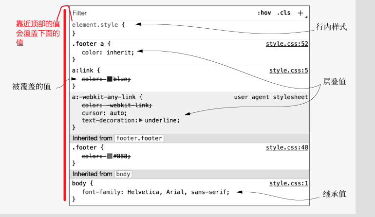
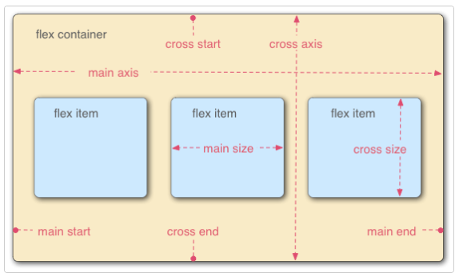
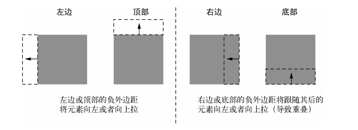

## 杂项

### 颜色单位

- RGBA设置透明度和opacity设置透明度有一个关键区别。当你使用不透明度时，你让元素和它里面的所有东西都不透明，而使用 RGBA 颜色只让你指定的颜色不透明

### 位置

- background-position 它可以使用关键字 (如 `top`, `left`, `bottom`, `right`, 以及 `center` ) 将元素与 2D 框的特定边界对齐，以及表示框的顶部和左侧边缘偏移量的长度。一个典型的位置值由两个值组成——第一个值水平地设置位置，第二个值垂直地设置位置。如果只指定一个轴的值，另一个轴将默认为 `center`。

### 内外边距：百分比

使用百分比作为元素外边距（margin）或填充（padding）的单位时，值是以包含它的块的**内联尺寸宽度**进行计算的

### 内联元素的特点

- 宽度 高度 上下边距设置无效
- 

### 为何img/input等内联元素内可以设置宽高

因为 ``、`<input>`属于替换元素，替换元素一般有内在尺寸和宽高比(auto时起作用)，所以具有width和height，可以设定。

### 垂直居中

- 可以用一个自然高度的容器吗？ 给容器加上相等的上下内边距让内容居中
- 容器需要指定高度或者避免使用内边距吗？对容器使用display: table-cell 和 vertical-align: middle
- 可以用 Flexbox 吗？
- 容器里面的内容只有一行文字吗？设置一个大的行高，让它等于理想的容器高度。这样会让容器高度扩展到能够容纳行高。如果内容不是行内元素，可以设置为inline-block
- 容器和内容的高度都知道吗？将内容绝对定位
- 不知道内部元素的高度？用绝对定位结合变形

### 对表单元素做的初始化

```css
button,
input,
select,
textarea {
  font-family: inherit;
  font-size: 100%;
  box-sizing: border-box;
  padding: 0; margin: 0;
}

textarea {
  overflow: auto;
}
```

### 表格格式化

* 使用 [`table-layout`](https://developer.mozilla.org/zh-CN/docs/Web/CSS/table-layout)`: fixed` 创建更可控的表布局，可以通过在标题[`width`](https://developer.mozilla.org/zh-CN/docs/Web/CSS/width)中设置[`width`](https://developer.mozilla.org/zh-CN/docs/Web/CSS/width)来轻松设置列的宽度。
* 使用 [`border-collapse`](https://developer.mozilla.org/zh-CN/docs/Web/CSS/border-collapse)`: collapse` 使表元素边框合并，生成一个更整洁、更易于控制的外观。
* 使用[`<thead>`](https://developer.mozilla.org/zh-CN/docs/Web/HTML/Element/thead), [`<tbody>`](https://developer.mozilla.org/zh-CN/docs/Web/HTML/Element/tbody)和[`<tfoot>`](https://developer.mozilla.org/zh-CN/docs/Web/HTML/Element/tfoot) 将表格分割成逻辑块，并提供额外的应用 CSS 的地方，因此如果需要的话，可以更容易地将样式层叠在一起。
* 使用斑马线来让其他行更容易阅读。
* 使用 [`text-align`](https://developer.mozilla.org/zh-CN/docs/Web/CSS/text-align)直线对齐您的[`<th>`](https://developer.mozilla.org/zh-CN/docs/Web/HTML/Element/th)和[`<td>`](https://developer.mozilla.org/zh-CN/docs/Web/HTML/Element/td)文本，使内容更整洁、更易于跟随。

### outline

`outline` 属性是在一条声明中设置多个轮廓属性的简写形式 ，例如outline-style/width/color

与border的区别在与不占用空间，绘制于元素内容(这里指包括border以内)周围

### 下划线

* 下划线是使用 [`border-bottom`](https://developer.mozilla.org/zh-CN/docs/Web/CSS/border-bottom) 创造的，而不是 [`text-decoration`](https://developer.mozilla.org/zh-CN/docs/Web/CSS/text-decoration)，有一些人喜欢这样，因为前者比后者有更好的样式选项，并且绘制的位置会稍微低一点，所以不会穿过字母 (比如 字母 g 和 y 底部).
* [`border-bottom`](https://developer.mozilla.org/zh-CN/docs/Web/CSS/border-bottom)的值被设置为 `1px solid`，没有指定颜色。这样做可以使边框采用和元素文本一样的颜色

## 层叠、优先级和继承

### 优先级

| 优先级     | important | 行内 | id             | 类             | 标签       | 值               |
| ---------- | --------- | ---- | -------------- | -------------- | ---------- | ---------------- |
| 优先级比值 | 1/0       | 1/0  | 一个id选择器+1 | 一个类选择器+1 | 一个标签+1 | 0，0，0，0，0，0 |

最后 源码顺序在最后的选择器会覆盖前边的选择器

- 伪类选择器（如:hover ）和属性选择器（如[type="input"]）与一个类选择
  器的优先级相同。通用选择器（*）和组合器（>、+、~ ）对优先级没有影响。
- 应该尽量采用优先级更低的选择器
- 想增加权重时可以通过添加一个类

### 继承

后代元素会继承父元素的部分属性，主要跟文本有关

- color 、font、font-family、font-size、
  font-weight、font-variant、font-style 、line-height、letter-spacing、text-align 、
  text- indent 、text- transform、white - space以及word- spacing
- 还有一些其他的属性也可以被继承，比如列表属性：list- style、list- style - type、
  list- style- position 以及list- style - image



#### inherit

```css
.footer {  
  color: #666;   
  background- color: #ccc; 
  padding: 15px 0;  
  text- align: center; 
  font- size: 14px;  
} 
 
.footer a {  
  color: inherit;//这里会继承父类的值   
  text- decoration: underline;   
}
```

#### initial

- 取属性的默认值，而非标签的默认属性值
- 简写属性会把省略的值变为默认值

## 相对单位

### em

- em等于当前元素设置的font-size大小
- font-size:1.2em 指继承了父元素的font-size
- font-size:1.2em;padding:1.2em 同时指定font-size和其他相对大小时使用em,先计算font-size的大小，在此基础上在计算其他属性值
- 嵌套结构设置1.xem 或者 0.xem会逐级增大或减小 解决方式
  - 当一个元素的值定义为长度（px 、em、rem ，等等）时，子元素会继承它的计算值

```css
    body {
      font-size: 16px;
    }

    ul {
      font-size: 0.8em;
    }

    ul ul {
      font-size: 1em;
      /* 把嵌套的元素设置为1em */
    }
```

### rem

- 根节点有一个伪类选择器，可以用来选中自己 :root
- rem就是相对root:font-size 的比例大小

```css
    :root{
      font-size: 26px;
    }
    ul {
      font-size: 2.2rem;
    }
```

### 拿不准的时候，用 rem 设置字号，用px 设置边框，用 em设置其他大部分属性

### 视口相对单位

视口——浏览器窗口里网页可见部分的边框区域。它不包括浏览器的地址栏、工具栏、状态栏

- 1vh 视口高度的1/100
- 1vw 视口宽度的1/100
- 1vmin 视口宽高中较小一方的1/100
- 1vmax 视口宽高较大一方的1/100

### calc()

calc() 函数内可以对两个及其以上的值进行基本运算。当要结合不同单位的值时，calc()特别实用。它支持的运算包括：加（+ ）、 减 （ − ）、乘（× ）、 除 （ ÷ ）。加号和减号两边必须有空白

```css
:root{
    font-size: calc(0.5em + 1vw);
    /* 保证了最小字号 */
}
```

### 行高

- 当行高定义为单位值时且为相对值时，如em，子元素继承父元素的计算值
- 当行高定义为无单位值时，子元素继承父元素的声明值

### 自定义属性值

- 变量名前面必须有两个连字符（--），用来跟 CSS 属性区分，剩下的部分可以随意命名
- 变量必须在一个声明块内声明，表示变量起作用的范围
  - 在使用变量时，依照层叠优先级

### 百分比

如果将元素的字体大小设置为百分比，那么它将是父元素字体大小的百分比。如果使用百分比作为宽度值，那么它将是父值宽度的百分比

如果父元素为内联元素，百分比宽高可以取更外层块级元素的宽高

## 弹性盒子

弹性盒子概念



- flex-direction 指定主轴的方向（弹性盒子子类放置的地方）——它默认值是 `row`，这使得它们在按你浏览器的默认语言方向排成一排（在英语/中文浏览器中是从左到右）
- flex-wrap:wrap 指flex item换行。
  - 如果item未设置宽度，item占整行
  - 如果item设置width:xpx,items按在宽度不够时换行
  - 如果item设置flex:xxpxitems 为item指定了最小宽度，如果在一行上items按该宽度不够铺满，则增加到正好够铺满的宽度
- 设置了wrap之后，flex-direction reverse的话，以行为单位reverse，而不是所有items
- flex-direction和flex-wrap合成一个简写形式flex-flow:row wrap
- items设置flex:a b c
  - a表示比例
  - c表示最小宽度
- align-items 控制在交叉轴(cross axis)的位置
  - 默认值stretch 拉伸到同一行的最大高度
  - center item保持原有高度，并垂直居中
  - start item保持原有高度，并居顶
  - end item保持原有高度，并居底
- align-self item控制自己的align属性
- justify-content 控制主轴(main-axis) items位置
  - 不能在items上设置 flex
  - 可以设置items的宽度
  - 默认值flex-start 所有items处于主轴的开始
  - flex-end
  - center
  - space-around
  - spance-between
- order item设置在items中的排列顺序
  - 所有item默认为0
  - 按数值从小到大排序
  - 可以为负
  - 不会修改dom结构顺序

## grid布局

一个网格通常具有许多的 **列（column）**与**行（row）** ，以及行与行、列与列之间的间隙，这个间隙一般被称为 **沟槽（gutter）** 。

- grid-template-columns: 设置items以几列排布

```css
div{
  grid-template-columns:200px 200px 200px;
  /* 设置为三列 每列宽200px 不会沾满一行 */
  grid-template-columns: 2fr 1fr 1fr;
  /* 设置为3列 按比例划分 沾满一行 */
  grid-template-columns: 200px 2fr 1fr;
  /* 设置为3列 第一列300px 后面两列按比例划分 沾满一行 */
  grid-template-columns: repeat(3 1fr);
  /* 设置为3列 每列1等分 */
  grid-template-columns: repeat(2 2fr 1fr);
  /* 设置为4列 2fr 1fr 2fr 1fr */
  grid-template-columns: repeat(auto-fill,minmax(200px,1fr));
  /* 根据minmax来自动填充一列 */
}
```

- grid-gap 是同时设置列和行之间沟槽的简写形式
  - grid-column-gap:20px
  - grid-row-gap:20px
- grid-column/grid-row
  - 开始线index/结束线index
  - 开始线index 相当于开始线index/auto

## 外边距

### 负外边距



### 外边距折叠

- 只有上下外边距会折叠，左右外边距不会
- 折叠指相邻元素边距取最大值，父子元素同样取最大值，因此父元素不会被子元素的外边距撑开
- 左右外边距会把边上的元素推开，也会把容器撑开

### 防止外边距折叠的方式

- 对容器使用overflow：除了visible之外的值防止内部元素的外边距跟容器外部的外边距折叠。这种方式副作用最小。
- 在两个外边距之间加上边框或者内边距，防止它们折叠。如给父容器加上边框
- 如果容器为浮动元素、内联块、绝对定位或固定定位时，外边距不会在它外面折叠。
- 当使用Flexbox布局时，弹性布局内的元素之间不会发生外边距折叠。网格布局同理

## 浮动

- 浮动元素不在普通文档流内，它的高度不会加到父元素上
- clear声明让该元素移动到浮动元素的下边，而不是侧边

### 清除浮动

clear声明只能加到块级元素上

方法一

```css
    .clearfix::after{
        content: ' ';
        display: block;
        clear: both;
        /* 给容器加上after伪元素来清除浮动 */
    }
```

这种方式浮动子元素和普通子元素在外边距的表现上不一致

- 普通子元素的外边距会折叠父元素
- 浮动子元素的外边距不会折叠父元素 而是包含在父元素中

方法二

```css
    .clearfix::after,
    .clearfix::before{
        display: table;
        content: ' ';
    }
    .clearfix::after{
        clear: both;
    }
```

- 无论是在单元格元素内部还是在单元格元素上下，设置了外边距的元素的外边距都跨过单元格元素
- display:table 内部隐式创建了单元行和单元格
- 上边的写法确保了容器内的元素外边距不会折叠容器的外边距

### 浮动的诡异行为


解决方式

- 浮动子元素设置百分比宽度，以确定每行几个
- 在每行的第一个元素上清楚浮动 `` :nth-child(xn+1){clear:both;}``

### BFC

给元素添加以下的任意属性值都会创建 BFC

- float：  left 或right，不为 none 即可。
- overflow ：hidden 、auto 或scroll，不为visible即可。
- display：inline-block、table-cell、table-caption、flex、inline-flex、grid 或inline-grid。拥有这些属性的元素称为块级容器（block container）。
- position：absolute 或position: fixed。

创建了BFC的元素的特点

- 包含了内部所有元素的上下外边距。它们不会跟 BFC 外面的元素产生外边距折叠。
- 包含了内部所有的浮动元素。
- 不会跟BFC 外面的浮动元素重叠。

### 栅格系统

```css
    :root{
        box-sizing: border-box;
    }
    *,::after,::before{
        box-sizing: inherit;
    }
    .row::after {
        content: ' ';
        display: block;
        clear: both;
    }
    .row{
        margin-left: -.75em;
        margin-right: -.75em;
    }
    [class*='column-'] {
        float: left;
        padding:0 .75em;
        margin-top: 0;
    }

    .column-1 {width: 8.3333%; }
    .column-2 {width: 16.6667%;}
    .column-3 {width: 25%;}
    .column-4 {width: 33.3333%;}
    .column-5 {width: 41.6667%;}
    .column-6 {width: 50%;}
    .column-7 {width: 58.3333%;}
    .column-8 {width: 66.6667%;}
    .column-9 {width: 75%;}
    .column-10 {width: 83.3333%;}
    .column-11 {width: 91.6667%}
    .column-12 {width: 100%;}
```
