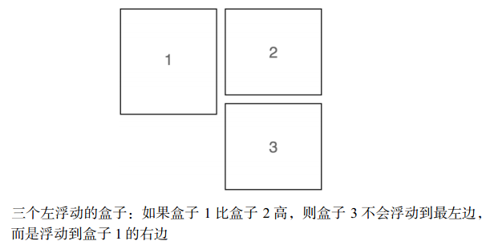

## 杂项

### 颜色单位

- RGBA设置透明度和opacity设置透明度有一个关键区别。当你使用不透明度时，你让元素和它里面的所有东西都不透明，而使用 RGBA 颜色只让你指定的颜色不透明

### 内联元素的特点

- 宽度 高度 上下边距设置无效

### 为何img/input等内联元素内可以设置宽高

因为 ``、`<input>`属于替换元素，替换元素一般有内在尺寸和宽高比(auto时起作用)，所以具有width和height，可以设定。

### 为何input设置为display:block 宽度并没有沾满一行

因为input比较特殊，其宽度由size决定，它表示不出滚动条的情况下大致能容纳的字符数量。可以使用width强制指定其宽度

### 下划线

* 下划线是使用 [`border-bottom`](https://developer.mozilla.org/zh-CN/docs/Web/CSS/border-bottom) 创造的，而不是 [`text-decoration`](https://developer.mozilla.org/zh-CN/docs/Web/CSS/text-decoration)，有一些人喜欢这样，因为前者比后者有更好的样式选项，并且绘制的位置会稍微低一点，所以不会穿过字母 (比如 字母 g 和 y 底部).
* [`border-bottom`](https://developer.mozilla.org/zh-CN/docs/Web/CSS/border-bottom)的值被设置为 `1px solid`，没有指定颜色。这样做可以使边框采用和元素文本一样的颜色

## 层叠、优先级和继承

### 优先级

| 优先级     | important | 行内 | id             | 类             | 标签       | 值               |
| ---------- | --------- | ---- | -------------- | -------------- | ---------- | ---------------- |
| 优先级比值 | 1/0       | 1/0  | 一个id选择器+1 | 一个类选择器+1 | 一个标签+1 | 0，0，0，0，0，0 |

最后 源码顺序在最后的选择器会覆盖前边的选择器

- 伪类选择器（如:hover ）和属性选择器（如[type="input"]）与一个类选择
  器的优先级相同。通用选择器（*）和组合器（>、+、~ ）对优先级没有影响。
- 应该尽量采用优先级更低的选择器
- 想增加权重时可以通过添加一个类

### 继承

后代元素会继承父元素的部分属性，主要跟文本有关

- color 、font、font-family、font-size、font-weight、font-variant、font-style 、line-height、letter-spacing、text-align 、text-indent 、text-transform、white-space以及word-spacing
- 还有一些其他的属性也可以被继承，比如列表属性：list- style、list-style-type、
  list-style-position 以及list-style-image


#### inherit

可以强制继承父元素的相同属性的值

#### initial

取属性的默认值，而非标签的默认属性值。比如display默认为inline，而div的display属性为block

#### 简写值

- 简写属性会把省略的值变为默认值
- 上、右、下、左的四值指定，按顺序指定，省略的值会取对边的值

## 相对单位

### em

- em等于当前元素设置的font-size大小
- 当设置padding height width border-radius等属性时，使用em会很方便，这是因为当元素继承了不同字号，或者用户改变了字号时，这些属性会跟着元素均匀缩放
- font-size:1.2em 指继承了父元素的font-size
- font-size:1.2em;padding:1.2em 同时指定font-size和其他相对大小时使用em,先计算font-size的大小，在此基础上在计算其他属性值
- 嵌套结构设置1.xem 或者 0.xem会逐级增大或减小 解决方式
  - 当一个元素的值定义为长度（px 、em、rem ，等等）时，子元素会继承它的计算值

```css
    body {
      font-size: 16px;
    }

    ul {
      font-size: 0.8em;
    }

    ul ul {
      font-size: 1em;
      /* 把嵌套的元素设置为1em */
    }
```

### rem

- 根节点(html)有一个伪类选择器，可以用来选中自己 :root
- rem就是相对root:font-size 的比例大小

```css
    :root{
      font-size: 26px;
    }
    ul {
      font-size: 2.2rem;
    }
```

### 拿不准的时候，用 rem 设置字号，用px 设置边框，用 em设置其他大部分属性

### 视口相对单位

视口——浏览器窗口里网页可见部分的边框区域。它不包括浏览器的地址栏、工具栏、状态栏

- 1vh 视口高度的1/100
- 1vw 视口宽度的1/100
- 1vmin 视口宽高中较小一方的1/100
- 1vmax 视口宽高较大一方的1/100
- 用视口大小定义字号可以在屏幕大小切换时平滑过渡，但会无限缩小放大

### calc()

calc() 函数内可以对两个及其以上的值进行基本运算。当要结合不同单位的值时，calc()特别实用。它支持的运算包括：加（+ ）、 减 （ − ）、乘（× ）、 除 （ ÷ ）。加号和减号两边必须有空白

```css
:root{
    font-size: calc(0.5em + 1vw);
    /* 保证了最小字号 */
}
```

### 行高

- 当父元素定义行高，且单位值时为相对值时，如em，子元素会继承父元素的计算值；
- 当行高定义为无单位值时，实际大小为该元素 字号*行高 。子元素会继承父元素的声明值

### 自定义属性值

- 变量名前面必须有两个连字符（--），用来跟 CSS 属性区分，剩下的部分可以随意命名
- 使用方法
  - 属性: var(变量名，[备用值])
- 变量必须在一个声明块内声明，表示变量起作用的范围
  - 更近的作用域会优先被子代继承

### 百分比

如果将元素的字体大小设置为百分比，那么它将是父元素字体大小的百分比。如果使用百分比作为宽度值，那么它将是父值宽度的百分比

如果父元素为内联元素，百分比宽高可以取更外层块级元素的宽高

## 盒模型

### box-sizing

- content-box


- border-box


### 高度问题

除非别无选择，否则不要明确设置元素的高度。先寻找一个替代方案。设置高度一定会导致更复杂的情况。

#### overflow

- visible 默认值，所有内容可见，即使溢出边缘
- hidden 溢出容器内边距的部分被裁剪
- scroll 出现滚动条
- auto 只有内容溢出时才会出现滚动条

#### 垂直居中指南

- 可以用一个自然高度的容器吗？给容器加上相等的上下内边距让内容居中
- 容器需要指定高度或者避免使用内边距吗？对容器使用display: table-cell 和vertical-align: middle 。
- 可以用 Flexbox 吗？
- 容器里面的内容只有一行文字吗？设置一个大的行高，让它等于理想的容器高度。这样会让容器高度扩展到能够容纳行高。如果内容不是行内元素，可以设置为inline-block 。
- 容器和内容的高度都知道吗？将内容绝对定位。

### 内外边距：百分比

使用百分比作为元素的内外边距的单位时，值是以包含它的块的**内联尺寸宽度**进行计算的

### 外边距:auto

会使外边距占满一行内剩余空间

### 负外边距

不同于内边距和边框宽度，外边距可以设置为负值。负外边距有一些特殊用途，比如让元素
重叠或者拉伸到比容器还宽。


### 外边距折叠

- 只有上下外边距会折叠，左右外边距不会
- 折叠指相邻元素边距取最大值，父子元素同样取最大值，因此父元素不会被子元素的外边距撑开
- 左右外边距会把边上的元素推开，也会把容器撑开

### 防止外边距折叠的方式

- 对容器使用overflow：除了visible之外的值防止内部元素的外边距跟容器外部的外边距折叠。这种方式副作用最小。
- 在两个外边距之间加上边框或者内边距，防止它们折叠。如给父容器加上边框
- 如果容器为浮动元素、内联块、绝对定位或固定定位时，外边距不会在它外面折叠。
- 当使用Flexbox布局时，弹性布局内的元素之间不会发生外边距折叠。网格布局同理

## 浮动

- 浮动元素不在普通文档流内，它的高度不会加到父元素上
- clear声明让该元素移动到浮动元素的下边，而不是侧边

### 清除浮动

clear声明只能加到块级元素上

方法一

```css
    .clearfix::after{
        content: ' ';
        display: block;
        clear: both;
        /* 给容器加上after伪元素来清除浮动 */
    }
```

这种方式浮动子元素和普通子元素在外边距的表现上不一致

- 普通子元素的外边距会折叠父元素
- 浮动子元素的外边距不会折叠父元素 而是包含在父元素中

方法二

```css
    .clearfix::after,
    .clearfix::before{
        display: table;
        content: ' ';
    }
    .clearfix::after{
        clear: both;
    }
```

- 无论是在单元格元素内部还是在单元格元素上下，设置了外边距的元素的外边距无法跨过单元格元素
- display:table 内部隐式创建了单元行和单元格
- 上边的写法确保了容器内的元素外边距不会折叠容器的外边距

### 浮动的诡异行为



解决方式

- 浮动子元素设置百分比宽度，以确定每行几个
- 在每行的第一个元素上清楚浮动 `` :nth-child(xn+1){clear:both;}``

### BFC

给元素添加以下的任意属性值都会创建 BFC

- float：  left 或right，不为 none 即可。
- overflow ：hidden 、auto 或scroll，不为visible即可。
- display：inline-block、table-cell、table-caption、flex、inline-flex、grid 或inline-grid。拥有这些属性的元素称为块级容器（block container）。
- position：absolute 或position: fixed。

创建了BFC的元素的特点

- 包含了内部所有元素的上下外边距。它们不会跟 BFC 外面的元素产生外边距折叠。
- 包含了内部所有的浮动元素。
- 不会跟BFC 外面的浮动元素重叠。

### 栅格系统

```css
    :root{
        box-sizing: border-box;
    }
    *,::after,::before{
        box-sizing: inherit;
    }
    .row::after {
        content: ' ';
        display: block;
        clear: both;
    }
    .row{
        margin-left: -.75em;
        margin-right: -.75em;
    }
    [class*='column-'] {
        float: left;
        padding:0 .75em;
        margin-top: 0;
    }

    .column-1 {width: 8.3333%; }
    .column-2 {width: 16.6667%;}
    .column-3 {width: 25%;}
    .column-4 {width: 33.3333%;}
    .column-5 {width: 41.6667%;}
    .column-6 {width: 50%;}
    .column-7 {width: 58.3333%;}
    .column-8 {width: 66.6667%;}
    .column-9 {width: 75%;}
    .column-10 {width: 83.3333%;}
    .column-11 {width: 91.6667%}
    .column-12 {width: 100%;}
```

## 弹性盒子

给元素添加 display: flex ，该元素变成了一个弹性容器（flex container ），它的直接子元素变成了弹性子元素（flex item ）。弹性子元素默认是在同一行按照从左到右的顺序并排排列。弹性容器像块元素一样填满可用宽度，但是弹性子元素不一定填满其弹性容器的宽度。弹性子元素高度相等，该高度由它们的内容决定。

### 弹性容器的属性

- justify-content 当子元素为填满容器时，该属性控制子元素沿主轴方向的间距。
  - 子元素的外边距会先进行计算
  - 如果任意子元素flex-grow不为0 或者外边距值为auto，justify-content就失效了
- align-items 控制子元素在副轴方向的对齐方式。align-items的初始值为stretch，在水平排列的情况下让所有子元素填充容器的高度，在垂直排列的情况下让子元素填充容器的宽度，因此它能实现等高列。


### 弹性子元素的属性

- flex-basis 如果设置了width，则使用width的值作为flex-basis的值；如果没有则用元素内容作为宽度大小。如果flex-basis的值不是auto，width的值会被忽略
- flex-grow flex-basis指定宽度后剩余宽度按flex-grow的比例分配
- flex-shrink 每个子元素的flex-shrink代表它是否应该收缩以防止溢出。如果某个子元素为
  flex- shrink: 0，则不会收缩；如果值大于 0，则会收缩至不再溢出。按照  flex-shrink 值
  的比例，值越大的元素收缩得越多。
- flex:66.7% 等价于flex:1 1 66.7%


## 网格布局

使用display:grid定义一个网格容器，容器会表现得像一个块级元素

### 重要概念

- 网格线 网格单元
- 
- 网格轨道:一个网格轨道是两条相邻网格线之间的空间。网格有水平轨道和垂直轨道
- 网格区域:网格上的矩形区域，由一个到多个网格单元组成。该区域位于两条垂直网格线和两条水平网格线之间。

### 属性

#### 容器属性

- grid-template-columns/rows中的fr这个单位跟 Flexbox中flex-grow因子的表现一样
  - 不一定非得用分数单位，可以使用其他的单位，比如 px 、em或百分数。也可以混搭这几种单位
  - 用repeat() 符号还可以定义不同的重复模式，比如 repeat (3, 2fr 1fr)会重复三遍这
    个模式，从而定义六个网格轨道，重复的结果是 2fr 1fr 2fr 1fr 2fr 1fr。还可以将 repeat() 作为一个更长的模式的一部分。比如 grid- template - columns: 1fr repeat(3, 3fr) 1fr 定义了一个1fr的列，接着是三个 3fr的列，最后还有一个 1fr的列
- grid-gap 属性定义了每个网格单元之间的间距。也可以用两个值分别指定垂直和水平方向的间距

#### 子元素属性

- grid-column/row: 可以在 grid-column 和grid-row 属性中用网格线的编号指定网格元素的位置。如果想要一个网格元素在垂直方向上跨越1 号网格线到 3 号网格线，就需要给元素设置grid-column: 1 / 3 。或者设置 grid-row: 3 / 5 让元素在水平方向上跨越 3 号网格线到 5 号网格线。这两个属性一起就能指定一个元素应该放置的网格区域。
  - 其实还可以用一个特别的关键字 span 来指定 grid-row 和grid-column 的值,这个关键字告诉浏览器元素需要占据几个网格轨道
  - 还可以grid-column:3/span 2结合使用，从第3格网络线开始占据两个网络轨道

#### 命名的网格线

声明网格轨道时，可以在中括号内写上网格线的名称

- grid-template-columns: [start] 2fr [center] 1fr [end]; 这条声明定义了两列的网格，三条垂直的网格线分别叫作 start 、center 和end
  - 之后定义网格元素在网格中的位置时，可以不用编号而是用这些名称来声明 grid- column: start / center;


#### 命名的网格区域

不用计算或者命名网格线，直接用命名的网格区域将元素定位到网格中。实现这一方法需要借助网格容器的grid-template-areas 属性和网格元素的grid-area 属性

```css
.container{
    display: grid;
    grid-template-columns: 2fr 1fr;
    grid-template-rows: repeat(4 auto);
    grid-template-areas: "title title"
                         "nav nav"
                         "main aside1"
                         "main aside2";
    grid-gap: 1.5em;
}
.header{
    grid-area: title;
}
.nav{
    grid-area: nav;
}
.main{
    grid-area: main;
}
.sidebar-top{
    grid-area: aside1;
}
.sidebar-bottom{
    grid-area: aside2;
}
```

#### 网格对齐方式

`justify-content`属性是整个内容区域在容器里面的水平位置（左中右），`align-content`属性是整个内容区域的垂直位置（上中下）

* start - 对齐容器的起始边框。
* end - 对齐容器的结束边框。
* center - 容器内部居中。
* stretch - 项目大小没有指定时，拉伸占据整个网格容器。
* space-around - 每个项目两侧的间隔相等。所以，项目之间的间隔比项目与容器边框的间隔大一倍。
* space-between - 项目与项目的间隔相等，项目与容器边框之间没有间隔。
* space-evenly - 项目与项目的间隔相等，项目与容器边框之间也是同样长度的间隔。

#### 单元格对齐方式

`justify-items` 属性设置单元格内容的水平位置（左中右），`align-items` 属性设置单元格的垂直位置（上中下）

* start：对齐单元格的起始边缘。
* end：对齐单元格的结束边缘。
* center：单元格内部居中。
* stretch：拉伸，占满单元格的整个宽度（默认值）。

#### 子元素对齐方式

- justify-self属性设置单元格内容的水平位置（左中右），跟 `justify-items`属性的用法完全一致，但只作用于子元素
- align-self `align-self`属性设置单元格内容的垂直位置（上中下），跟 `align-items`属性的用法完全一致，也是只作用于单个项目。

## 定位

- 绝对定位和固定定位会把元素移移出正常文档流，并且不会为元素预留空间
- 绝对定位和固定定位会使元素在未指定width和height时，按内容和top/bottom/left/right调整大小

### 固定定位和绝对定位模态框

```html
<style>
    :root{
        box-sizing: border-box;
    }
    *,::after,::before{
        box-sizing: inherit;
    }
    body{
        margin: 0;
        padding: 0;
        min-height: 200vh;
    }
    button{
        padding: .5em .7em;
        border: 1px solid #987;
        background-color: #fff;
    }
    .modal{
        display: none;
    }
    .modal-shade{
        position: fixed;
        left: 0;
        right: 0;
        top: 0;
        bottom: 0;
        background-color: rgba(0, 0, 0, .5);
    }
    .modal-body{
        position: fixed;
        left: 30%;
        right: 30%;
        top:10em;
        bottom: 10em;
        background-color: #fff;
        padding: 2em;
        overflow: auto;
    }
    .close{
        position: absolute;
        right: 0;
        top:0;
        border: 0;
        text-indent: 10em;
        overflow: hidden;
        font-size: 2em;
        width: 1em;
        height: 1em;
        cursor: pointer;
    }
    .close::after{
        content: '\00D7';
        position: absolute;
        top: .2em;
        left: .5em;
        line-height: 1;
        text-indent: 0;
    }
</style>
<body>
    <button id="btn">show</button>
    <div class="modal" id="modal">
        <div class="modal-shade"></div>
        <div class="modal-body">
            <button class="close" id="close">close</button>
            <h3>Lorem, ipsum dolor sit amet consectetur adipisicing elit. Adipisci, ipsa.</h3>
            <form>
                <p>
                    <label for="username">username:</label>
                    <input type="text" id="username" name="username">
                </p>
                <button onclick="return false">submit</button>
            </form>
        </div>
    </div>
    <script>
        let modal=document.getElementById('modal');
        document.getElementById('btn').onclick=function(){
            modal.style.display='block';
        };
        document.getElementById('close').onclick=function(){
            modal.style.display='none';
        };
    </script>
</body>
```

### 绝对定位和相对定位下拉列表

```html
<style>
    :root {
        box-sizing: border-box;
    }
    *,
    ::after,
    ::before {
        box-sizing: inherit;
    }
    .dropdown{
        display: inline-block;
    }
    .dropdown-label{
        color: #111;
        padding: .5em 2em .5em 1em;
        background-color: #eee;
        border: 1px solid #dfdfdf;
        position: relative;
    }
    .dropdown-label::after{
        content: '';
        border: .3em solid;
        border-color: #111 transparent transparent;
        position: absolute;
        right: 1em;
        top: 1em;
    }
    .dropdown-menu{
        display: none;
    }
    .dropdown:hover .dropdown-menu{
        display: block;
    }
    .dropdown:hover .dropdown-label::after{
        top: .8em;
        border-color: transparent transparent #111;
    }
    .nav{
        margin: 0;
        padding: 0;
        list-style: none;
        background-color: #eee;
        border: 1px solid #dfdfdf;
    }
    .nav li+li{
        border-top:1px solid #dfdfdf;
    }
    .nav a{
        display: block;
        text-decoration: none;
        color: #1d9ae4;
        padding: .5em 2em .5em 1em;
    }
    .nav a:hover{
        background-color: #fff;
    }
</style>
<div class="dropdown">
    <div class="dropdown-label">main menu</div>
    <div class="dropdown-menu">
        <ul class="nav">
            <li><a href="javascript:void(0)">home</a></li>
            <li><a href="javascript:void(0)">home</a></li>
            <li><a href="javascript:void(0)">home</a></li>
            <li><a href="javascript:void(0)">home</a></li>
            <li><a href="javascript:void(0)">home</a></li>
        </ul>
    </div>
</div>
```

### 层叠上下文

#### x渲染树

- 通常情况下，元素在HTML中出现的顺序就是渲染的顺序
- 定位元素时，浏览器会先绘制非定位元素，再绘制定位元素

#### 层叠上下文

给一个定位元素加上z-index，它就变成新的层叠上下文的根，所有后代元素都是这个层叠上下文的一部分

文档根节点html会给整个页面创建一个顶级层叠上下文

所有层叠上下文中的元素按照以下顺序从后往前叠放

1. 层叠上下文的根
2. z-index为负的定位元素和其子元素
3. 非定位元素
4. z-index为auto的定位元素和其子元素
5. z-index为正的定位元素和其子元素

## 响应式设计

三大原则，同时也是设计顺序

1. 移动优先
2. @media规则
3. 流式布局

### 移动优先

<metaname="viewport"content="width=device-width, initial-scale=1.0">

这个 HTML 标签告诉移动设备，你已经特意将网页适配了小屏设备。如果不加这个标签，移动浏览器会假定网页不是响应式的，并且会尝试模拟桌面浏览器

汉堡包导航

```html
<style>
    .menu {
        position: relative;
    }

    .menu-toggle {
        font-size: 3rem;
        position: absolute;
        right: 0;
        top: -1.2em;
        width: 1em;
        height: 1em;
        text-indent: 10em;
        white-space: nowrap;
        overflow: hidden;
        background-color: transparent;
        border: 0;
    }

    .menu-toggle::after {
        position: absolute;
        left: .1em;
        top: 0;
        content: '\2261';
        text-indent: 0;
        line-height: 1;
    }

    .menu-dropdown {
        position: absolute;
        left: 0;
        right: 0;
        background-color: #333;
        display: none;

    }

    .is-open {
        display: block;
    }

    .menu-dropdown ul {
        padding: 0;
        margin: 0;
    }

    .menu-dropdown li+li {
        margin-top: .1em;
        border-top: 1px solid #fff;
    }

    .menu-dropdown a {
        display: block;
        padding: .2em 1em;
        color: #fff;
    }
</style>
<div class="menu">
    <button class="menu-toggle">
        toggle menu
    </button>
    <div class="menu-dropdown">
        <ul class="nav-menu">
            <li><a href="javascript:void(0)">about</a></li>
            <li><a href="javascript:void(0)">about</a></li>
            <li><a href="javascript:void(0)">about</a></li>
            <li><a href="javascript:void(0)">about</a></li>
        </ul>
    </div>
</div>
```

### 媒体查询

媒体查询遵循层叠规则，所以要把媒体查询后的样式放到正常样式后边

@media(min-width:20em) 大于20em的视口

@media(max-width:50em) 小于50em的视口

@media(min-width:20em) and (max-width:35em) 大于20em且小于50em的视

@media(max-width:20em), (min-width:35em) 小于20em或者大于35em 的视口

@media print{

 color:black !important;

 background:none !important;

}

需要打印的样式放到print里

## 模块化

指把页面分割成不同的组成部分，这些组成部分可以在多种上下文中重复使用，并且互相之间没有依赖关系。最终目的是，当我们修改其中一部分 CSS 时，不会对其他部分产生意料之外的影响

### 模块样式

- 一个模块.module 记录基本样式
- 模块下的子元素.module-xxx 记录子元素的基本样式
- 模块元素状态.module-xx--yyy 记录元素在特定状态下的样式

### 模块拆分

如果你不得不使用并或者和）这个词来表述模块的职责，那你可能正在描述多项职责，这时候模块是可以继续拆分的

### 工具类

单一状态的类，要加到特点元素下才会体现作用
