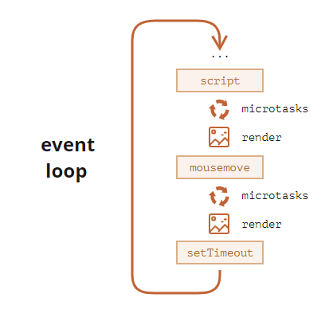
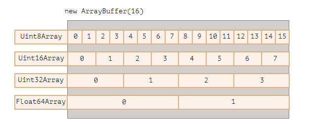
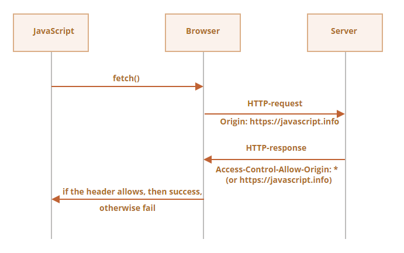
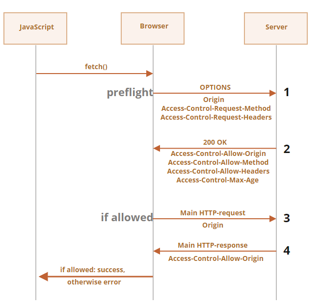
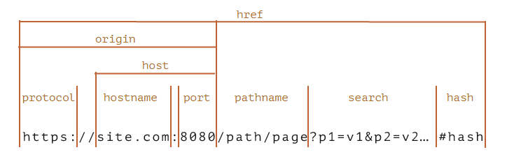

### let 和 var

- let声明的范围是块作用域，而var声明的范围是函数作用域，没有块级作用域的说法
- JavaScript引擎会记录用于变量声明的标识符及其所在的块作用域，因此嵌套使用相同的标识符不会报错，即变量名+块id 确定一个变量
- 使用let在全局作用域中声明的变量不会成为window对象的属性，不过，let声明仍然是在全局作用域中发生的，相应变量会在页面的生命周期内存续。
- let生命的变量存在死区

```javascript
let x = 1;

function func() {
  // 引擎从函数开始就知道局部变量 x，
  // 但是变量 x 一直处于“未初始化”（无法使用）的状态，直到结束 let（“死区”）
  // 因此答案是 error

  console.log(x); // ReferenceError: Cannot access 'x' before initialization

  let x = 2;
}

func();
```

### strict严格模式下

- 严格模式下，当一个函数声明在一个代码块内时，它在该代码块内的任何位置都是可见的。但在代码块外不可见。
- 在非严格模式下，函数在代码块外可见，相当于var声明

```javascript
'use strict'
/*
没有use strict正常输出
有的话报错sayHi is not defined
*/
let phrase = "Hello";

if (true) {
  let user = "John";

  function sayHi() {
    alert(`${phrase}, ${user}`);
  }
}

sayHi();
```

- 无论是否在严格模式下，setTimeOut和setInterval中的函数中的this默认指向global对象
- 严格模式下属性标志writable:false，为属性赋值会报错。非严格模式下，只是操作不成功

### 两种短路操作

- && 返回第一个转boolean为false的原值，如果操作数都是true，返回最后一个操作数的原值
- || 返回第一个转boolean为true的原值，如果操作数都是false，返回最后一个操作数的原值

### 空值合并运算符‘？？’

- 如果第一个参数不是 `null/undefined`，则 `??` 返回第一个参数。否则，返回第二个参数。
- 不能和|| &&一起使用

### 可选链?.

- 如果可选链 `?.` 前面的值为 `undefined` 或者 `null`，它会停止运算并返回 `undefined`。
- ?.()会检查前边部分的函数是否存在，如果存在就调用，如果不存在则停止运算
- ？.[]读取属性
- 可以和delete一起使用
- 只能用来读取，不能用来写入

```javascript
let user={
  admin(){
    console.log('i am admin');
  }
}
let userGuest={};
user.admin?.();
userGuest.admin?.();//无事发生

delete user?.name;//无事发生
```

### typeof function、null

- ECMA-262规定，任何实现内部[[Call]]方法的对象都应该在typeof检测时返回"function",这也是来自于 JavaScript 语言早期的问题。从技术上讲，这种行为是不正确的，但在实际编程中却非常方便。
- `typeof null` 的结果为 `"object".`

### function是对象

- name属性，函数的名称，会根据上下文推断、
- length属性 函数定义时入参的个数，...rest不参与计算
- 可以位函数添加属性，这个新添加的属性对它的执行没有任何影响
- 命名函数表达式 let f=function **f1** (){}
  - 仍然是函数表达式，而不是函数声明
  - 可用于递归
  - 在函数外不可见，也就是在递归调用时，外部通过修改函数变量不会影响到函数内部

```javascript
'use strict'
function f(){
  console.log(123);
}
f=null;
f();//error: f is not a function
```

```javascript
'use strict'
let f1 = function f(){
  console.log(123);
}
f=null;//error f is not defined
```

### this指向

- 在非严格模式下，当一个函数在没有明确（通过成为某个对象的方法，或者通过call()/apply()）指定this值的情况下执行时，this值等于Global对象
- 在严格模式下，this没有指向时，this为undefined
- 箭头函数的this指向函数外层的this

### arguments

- arguments同时时array like和iteabel
- 箭头函数没有arguments,访问到的arguments属于外部函数

### call，apply和bind

- func.call和func.apply 返回func的执行结果
  - call期望的参数与func的形式一致
  - apply期望的参数是类数组，arguments正好是类数组
  - apply内部有优化 会更快
- func.bind 返回类似于函数的特殊对象，就行绑定了this的func.
  - 类函数保存了bind当时的状态，即使func后来被改变了 类函数的执行还是当时的状态

### Math.random()

Math.random()方法返回一个0-1的随机小数，包含0但不包含1.从一组连续整数中随机出一个数：
number = Math.floor(Math.random()*totalnumberofchoices+firstpossiblevalue)

### 目标节点

浏览器总是假定click事件的目标节点，就是点击位置嵌套最深的那个节点

```html
<div id="div"><button id="btn">click</button></div>
```

```javascript
document.getElementById('div').addEventListener('click',function(e){
console.log(e.target);//button
console.log(e.currentTarget);//div
},false);
```

### 在js中使用模块功能前提

- 在你的 HTML 中需要包含 type="module" 的 `<script>` 元素这样的脚本，以便它被识别为模块并正确处理
- 不能通过 file:// URL 运行 JS 模块 — 这将导致 CORS 错误。你需要通过 HTTP 服务器运行。

### 跨域的定义

根据[MDN Web Docs](https://link.zhihu.com/?target=https%3A//developer.mozilla.org/zh-CN/docs/Web/HTTP/Access_control_CORS) 里的定义，跨域是指 *当一个资源从与该资源本身所在的**服务器不同的域或端口不同的域或不同的端口**请求一个资源时，资源会发起一个 **跨域 HTTP 请求** 。* 也就是说，正常的跨域情况，是你访问了一个A网站，然后这个网站返回的资源里面，请求了B网站/端口的资源，于是就跨域了。所以，跨域这个情况只会出现在浏览器页面里，因为实际上是浏览器由于安全原因限制了这些请求的访问。

### ==和===

- 处于相等判断符号 `==` 两侧的值会先被转化为数字
- 严格相等运算符 `===` 在进行比较时不会做任何的类型转换。
- `undefined` 和 `null` 在相等性检查 `==` 中不会进行任何的类型转换，它们有自己独立的比较规则，所以除了它们之间互等外，不会等于任何其他的值

### 对象key的顺序

- 整数属性会被进行排序，其他属性则按照创建的顺序显示
- 这里的“整数属性”指的是一个可以在不做任何更改的情况下与一个整数进行相互转换的字符串。

### 构造函数

```javascript
function User(name){
  this.name=name;
}
//使用new调用
function User(name){
  this={};
  this.name=name;
  return this;
}
```

### Object系列方法

- Object.keys(obj) 返回对象所有键的数组
- Object.values(obj) 返回对象所有值的数组
- Object.entries(obj) 返回对象所有键值对 [key,value] 的数组
- 以上几种方法都会忽略Symbol键
- Object.getOwnPropertySymbols(obj) 返回对象所有Symbol类型的键的数组
- Object.fromEntries(iterable) 把键值对列表转换为对象

### instanceof操作符 obj instanceof Class

- 先判断class是否有静态方法Symbol.hasInstance  该方法接受obj作为参数 返回Boolean结果
- 接着检查Class.prototype是否在obj的原型链上

### Object.prototype.toString方法

- 可以通过call/apply/bind来在所有类型的对象上执行
- 返回这个对象的Symbol.toStringTag属性

```javascript
let user={
  [Symbol.toStringTag]:'user'
}
let u = Object.prototype.toString.call(user);
//或者
let u1 = {}.toString.call(user);
console.log(u);//[object user]
console.log(u);//[object user]
```

- js中所有的类型都实现了这个属性
  * 对于 number 类型，结果是 `[object Number]`
  * 对于 boolean 类型，结果是 `[object Boolean]`
  * 对于 `null`：`[object Null]`
  * 对于 `undefined`：`[object Undefined]`
  * 对于数组：`[object Array]`

### typeof {}.toString.call() instanceof

| typeof           | 用于原始数据类型                                         | 返回string |
| ---------------- | -------------------------------------------------------- | ---------- |
| {}.toString.call | 用于原始数据类型，内建类型，有symbol.toStringTag属性类型 | 返回string |
| instanceof       | 对象                                                     | Boolean    |

### for...in循环和Object.keys的区别 以及属性遍历的方法

```javascript
'use strict'
let user={
  name:'wyj'
}
let admin={
  isAdmin:true,
  __proto__:user
}

console.log(Object.keys(admin));//只有isAdmin
for(let key in admin){
  console.log(key);//会遍历自己的以及继承的key
}
for(let key in admin){
  if(admin.hasOwnProperty(key)){
    console.log(key);//使用obj.hasOwnProperty(key)判断是否是自己的属性
  }
}
```

#### 遍历方法

* `Object.getOwnPropertyNames(obj)` 返回非 symbol 键。
* `Object.getOwnPropertySymbols(obj)` 返回 symbol 键。
* `Object.keys/values()` 返回带有 `enumerable` 标志的非 symbol 键/值。
* `for..in` 循环遍历所有带有 `enumerable` 标志的非 symbol 键，以及原型对象的键。

### 每隔一段时间执行方法的两种方式

```javascript
let delay = 1000;
let timeId=setTimeout(function f(){
  //xxxx
  timeId=setTimeout(f,delay);
  //可以修改delay
  //可以停止
},delay);

let id=setInterval(function(){
  //xxx
  //可以停止
},delay);
```

### 异常处理

#### 异常扩展

```javascript
class MyError extends Error{
  constructor(messsage){
    super(messsage);
    this.name=this.constructor.name;
  }
}

class ValidateError extends MyError{

}

class PropertyRequiredError extends ValidateError{
  constructor(property){
    super(property + ' required');
    this.property=property;
  }
}

try{
  let u=JSON.parse('{"age":18}');
  if(!u.name){
    throw new PropertyRequiredError('name');
  }
}catch(error){
  if(error instanceof ValidateError){
    console.log(error);
    console.log(error.name);
    console.log(error.message);
  }else if(error instanceof SyntaxError){
    console.log("JSON Syntax Error: " + error.message);
  }else{
    throw error;
  }
}
```

#### 全局异常处理

```javascript
window.onerror = function(message, url, line, col, error) {
    alert(`${message}\n At ${line}:${col} of ${url}`);
  };
```

### json

#### json格式

```javascript
let json = `{
    name: "John",                     // 错误：属性名没有双引号
    "surname": 'Smith',               // 错误：值使用的是单引号（必须使用双引号）
    'isAdmin': false                  // 错误：键使用的是单引号（必须使用双引号）
    "birthday": new Date(2000, 2, 3), // 错误：不允许使用 "new"，只能是裸值
    "friends": [0,1,2,3]              // 这个没问题
  }`;
```

#### json系列方法

- JSON.parse(str,(key,value)=>{//处理key value})

```javascript
let str = '{"title":"Conference","date":"2017-11-30T12:00:00.000Z"}';

let meetup = JSON.parse(str, function(key, value) {
  if (key == 'date') return new Date(value);
  return value;
});

alert( meetup.date.getDate() );
```

- JSON.stringify(obj,[...keys]|(key,value)=>{//处理key value},number|string)
- 上边的number是空格的数量，string是用具体的字符串表示缩进
- 循环引用会报错
- 在要被序列化的对象中添加toJson方法，会在序列化时默认调用
  - toJson

### 解构赋值

#### 数组

- 等号右边可以是任意Iterable
- 等号左边是可以被赋值的项

```javascript
let user={};
[user.name,user.age]=['wyj',30];
console.log(user.name);
console.log(user.age);
```

```javascript
let a='a';
let b='b';
[a,b]=[b,a];
console.log(a);//b
console.log(b);//a
```

#### 对象

- 使用 `：`来给属性赋值另一个名字的变量
- 智能函数参数

```javascript
function showMenu(title = "Untitled", width = 200, height = 100, items = []) {
  // ...
}

showMenu(null,null,2000,10);
//上边是难看版本
function showMenu({title = "Untitled", width = 200, height = 100, items = []}={}) {
    // ...
}

showMenu({
    width:900,
    item:[12,3],
})
```

#### 在方法参数中的使用

```javascript
function dosth(arg1,arg2,...rest){}
function dosth1(...rest){}
let arr1=[1,2,3];
let arr2=[3,4,5];
dosth1(...arr1,7,8,9,...arr2);

```

### 对象包装器

#### 出现的原因

- 人们希望可以对原始类型执行操作
- 同时希望原始类型尽量简单

#### 解决方式

- 原始类型任然是原始的，提供单个值
- 在访问其属性和方法时，创建其包装对象，访问包装对象的方法和属性
- 销毁包装对象，只留下原始值

```javascript
let str='abc';//1
str.test=5;//2
console.log(str.test);//3
//非严格模式下undefind,因为在2时，test属性添加后，包装对象就销毁了，在3又创建了另一个包装对象
//在严格模式下会报错：Cannot create property 'test' on string 'abc'
```

### Number类型的精度问题

`` o.1+0.2 == 0.3//false``

#### 出现的原因

- 在内部数字以64位二进制存储，其中52位存储数字，11位标识小数点的位置，1位用于符号 ``1e500//infinity``
- 二进制数字系统中，可以保证以2的整数次幂作为除数正常工作，但其他的除数都变成无限循环小数
- js中的数字通过将数字舍入最接近的数字来解决问题，这些舍入规则是我们丢失了极小的精度

#### 解决方法

```javascript
let sum=0.1+0.2;
console.log(sum.toFixed(2));

let n=6.35;
console.log(n.toFixed(1));//6.3
//出现的原因,如下，四舍五入就变成6.3
console.log(n.toFixed(20));//6.34999999999999964473
//解决方法
console.log(Math.round(6.35*10)/10);
```

### 字符串比较

- 从第一位开始对比相同位置字符UTF-16的编码大小
- 因为不同语言的字母都不相同，因此浏览器需要知道要比较的语言
- 现代标准提供了比较不同语言的字符串的方法 ``str1.localCompare(str2)//返回正数负数或0``

```javascript
let str='AaBbCc3456';
let index;
for(let i=0;i<str.length;i++){
  index=str.codePointAt(i);//返回所在位置编码数字
  console.log(index);
  console.log(String.fromCodePoint(index));//返回编码代表的字符
}
```

### Symbol

- symbol表示唯一的标识符，用**Symbol()来创建值**
- 可以使用**Symbol('xx')** 给symbol一个描述
- symbol创建出来即唯一，与描述无关
- symbol不会被隐式转换为字符串，这是一种防止混乱的“语言保护”，因为字符串和 symbol 有本质上的不同，不应该意外地将它们转换成另一个。如果我们真的想显示一个 symbol，我们需要在它上面调用 `.toString()，或者获取 symbol.description 属性`

#### 作用

- 用来表示对象的属性键值
- 代码的任何其他部分都不能访问或改写这些属性
- symbol属性在for-in循环中、在Object.keys()中不能被访问到
- Object.assign()会同时复制字符串和symbol属性

### Object与原始值的转换

#### string

```javascript
alert(obj); 
anotherObj[obj]
```

#### number

```javascript
Number(obj);
+obj;
date1-date2;
user1>user2;
```

#### default

```javascript
obj1+obj2;//因为字符串和数字都可以应用+
if(user==1){
	//与字符串、数字、symbol进行==比较，这时应该用哪种转换不明显，因此也是用default
}
```

#### 转换时进行的操作

- 如果存在[Symbol.toPrimitive]方法，这调用这个方法完成所有转换
  - 这个方法必须返回一个原始值，否则会报错
- 否则，如果hint是string，尝试调用 `toString`或者 `valueOf方法`
- 否则，如果hint是number或者default，尝试调用 valueOf或者 `toString`

```javascript
let user={
  name:'john',
  age:19,
  [Symbol.toPrimitive](hint){
    console.log(`hint,${hint}`);
    return hint=='string'?this.name:this.age;
  }
}

alert(+user);//hint,number    19
alert(user);//hint,string    john
alert(user+500);//hint,default  519
```

##### toString/valueOf

- string hint 优先调用toString
- 其他hint 优先调用valueOf
- 这些方法必须返回原始值，返回对象会被忽略
- 默认情况下，普通对象已经具有toString和valueOf方法
  - toString返回 "[object Object]"
  - valueOf返回对象自身
- 可以重写这些方法

```javascript
let user={
  name:'wyj',
}

alert(user);//[object Object]
alert(user===user.valueOf());//true
alert(user+2);//二元加法：更愿意接受字符串
```

### Iterator

- 对象有Symbol.iterator的方法
- 当for...of循环启动时，会调用这个方法，如果没有则报错
- 这个方法必须返回一个迭代器，一个有next方法的对象
- for...of循环获取下一个值时，调用对象的next方法
- next方法返回的结果格式为{done:Boolean,value:any}

#### 简单示例

- 第一种

```javascript
let user = {
  from: 1,
  to: 5,
  [Symbol.iterator]() {
    return {
      current: this.from,
      last: this.to,
      next() {
        if (this.current <= this.last) {
          return { done: false, value: this.current++ };
        } else {
          return { done: true };
        }
      },
    };
  },
};

for(let item of user){
    console.log(item);
}
```

- 第二种

```javascript
let user = {
  from: 1,
  to: 5,
  [Symbol.iterator]() {
    this.current=this.from;
    return this;
  },
  next(){
    if(this.current<=this.to){
        return {done:false,value:this.current++};
    }else{
        return {done:true};
    }
  }
};

for(let item of user){
    console.log(item);
}
```

#### 可迭代对象和类数组/iterable&array-like

- array-like是有索引和length属性的对象
- 这两种都可以被Array.from方法转变成数组

### Map和Set

#### 示例代码

```javascript
let map=new Map;
map.set(1,'abc');
map.set('1',1);
map.set(true,'boolean');
console.log(map.get(1));
map.delete(1);
for(let i of map.keys()){
    console.log(i);
}
for(let i of map.values()){
    console.log(i);
}
for(let i of map.entries()){
    console.log(i);
}//for of map默认
let entries = Object.entries({
    a:1,
    b:2,
    c:3,
});
console.log(entries);
/*
    [['a',1],['b',2],['c',3]]
*/
let map2=new Map(entries);
Object.fromEntries(map2);
/*
    [['a',1],['b',2],['c',3]]
*/
```

### WeakMap和WeakSet

#### weak

- 只能用对象作为键(weakmap)和值(weakmap)
- 当这些对象除了作为weakmap的键或weakmap的值，在其他的地方都不可达时，它们所代表的项也会在集合中被自动清除
- 由于集合中项的移除是由垃圾回收器自动执行，所以不能确定weak集合中确定的项
- 不支持clear size keys values和迭代

#### 示例代码

- map和set

```javascript
let m=new Map;
let obj={name:'wyj'};
m.set(obj,1);
obj=null;
console.log(m.size);
/*
结果是1，
因为{name:'wyj'}这个对象被作为m的键引用着
*/
```

- weakmap和weakset

```javascript
class VisitCount{
    visitCountMap=new WeakMap;
    countUser(user){
        let count=this.visitCountMap.get(user)||0;
        this.visitCountMap.set(user,count+1);
    }
}
//在另外的地方调用
let v=new VisitCount();
let user={name:'wyj'};
v.countUser(user);
user=null;//用户离开后，visit自动清空
```

### Date

#### 构造函数

- 无参 创建当前时间的date对象
- new Date(milliseconds) 创建一个 `Date` 对象，其时间等于 1970 年 1 月 1 日 UTC+0 之后经过的毫秒数
  - date.getTime() 或者把date转化为number可以获取毫秒数
  - 创建1970 年 1 月 1 日之前的时间用负数
- new Date(str) 创建一个 Date对象，字符串格式为 'YYYY-MM-DDTHH-mm-ss.sssZ'
  - T是分割符
  - 可选Z是 +-hh:mm代表时区
  - Date.parse(str) 方法有相同的用法
- new Date(year,month,date,hours,minutes,seconds,ms) 创建Date对象
  - 其中前两个参数是必须的
  - month从0开始代表一月
  - date默认是1，h m s ms默认是0

#### 不易记住的方法

- getDate() 返回的日期 从1开始
- getDay() 返回星期几 从0开始代表周日
- set系列方法和构造函数都有自动校准功能
- Date.now() 它相当于 `new Date().getTime()`，但它不会创建中间的 `Date` 对象。因此它更快，而且不会对垃圾回收造成额外的压力

```javascript
let date1 = new Date(2013, 0, 32); // 32 Jan 2013 ?!?
alert(date1); // ……是 1st Feb 2013!

let date2 = new Date(2016, 1, 28);
date3.setDate(date2.getDate() + 2);

alert( date2 ); // 1 Mar 2016

let date3 = new Date();
date3.setSeconds(date3.getSeconds() + 70);

alert( date3 ); // 显示正确的日期信息
```

##### 这月有多少天

```javascript
function getLastDayOfMonth(year, month) {
  let date = new Date(year, month + 1, 0);
  return date.getDate();
}
```

### 词法环境

#### 概念

- 每个运行的函数，代码块以及整个脚本，都有词法环境
- 由两部分组成
  - 环境记录:一个对象，存储所有局部变量、this等其他信息作为其属性
  - 对外部词法变量的引用

#### 函数

- 所有函数在诞生时，都会记住创建它的词法环境
- 所有函数都有一个隐藏的Environment属性，保存了对创建该函数的词法变量的引用

### 数据属性标志和数据属性描述符

#### Object.getOwnPropertyDescriptor

```javascript
let user = {
  name: "John"
};

let descriptor = Object.getOwnPropertyDescriptor(user, 'name');

alert( JSON.stringify(descriptor, null, 2 ) );
/* 属性描述符：
{
  "value": "John",
  "writable": true,
  "enumerable": true,
  "configurable": true
}
*/
```

#### Object.defineProperty(obj,propetyName,descriptor)

- 如果该属性propertyname存在 更新其desc
- 如果不存在创建新的属性
- 没有提供的标志，默认为false
- 通过obj.xxx {xxx:''}这些方式添加的属性，默认标志都是true
  - enumerable:false
    - 不可枚举
    - 不会出现在for..in循环中
    - 不会出现在Object.keys中
  - configurable:false
    - 不可配置
    - 属性不能被删除
    - 属性的标志不能被修改
    - 有一个例外writable可以从ture->false
  - value
  - writable

#### Object.defineProperties(obj,descriptors)

- 允许一次定义多个属性

#### Object.getOwnPropertyDescriptors

- 返回包含symbol类型和不可枚举的属性在内的所有属性描述
- 与Object.defineProperties配合使用可以克隆对象

```javascript
let obj={name:'wyj'};
let clone=Object.defineProperties({},Object.getOwnPropertyDescriptors(obj));
console.log(clone);
```

### 访问器属性

```javascript
let user={
  firstname:'wang',
  lastname:'yj',
  get fullname(){
    return this.firstname+' '+this.lastname;
  },
  set fullname(value){
    [this.firstname,this.lastname]=value.split(' ');
  }
};
```

#### 访问器属性的描述符

- get 函数
- set 函数
- enumerable 访问器属性也在for..in和objct.keys()中
- configurable

```javascript
function User(name,birth){
  this.name=name;
  this.birth=birth;
  Object.defineProperty(this,'age',{
    get(){
      return new Date().getFullYear()-birth.getFullYear();
    }
  })
}

let u=new User('wyj',new Date('1991-6-21'));
console.log(u.age);
```

### 原型继承

- 对象有一个隐藏的属性[[Prototype]],形成原型链
  - 这个属性可以通过 `` __proto__``访问器访问
    - `` __proto__``是对[[Prototype]]属性的访问器属性
    - 现在代码通过 `` Object.getPrototypeOf/Object.setPrototypeOf``两个方法代替 `` __proto__``
- 构造函数有prototype属性 F.prototype
  - 由此构造函数创建的对象的[[Prototype]]属性 指向构造函数的prototype属性
  - F.prototype仅在new F是被瞬时赋值，如果之后修改为新对象，之前new F创建的对象的[[Prototype]]会引用旧对象
  - 构造函数默认有prototype属性，是只有一个constructor属性的对象
    - constructor默认指向构造函数
    - 因此不知道构造函数的时候，要创建类似的对象可以这样

```javascript
function Obj(){}

let obj=new Obj();
let obj2=new obj.constructor();
```

### 类

#### 基本概念

- type class === 'function'
- class不仅仅是语法糖
  - class 函数有特殊的[[IsClassConstructor]]:true属性，这个属性是class函数只能通过new来调用，否则会报错
  - class 的字符串表示都已class开头
  - class中的方法不可枚举，类定义将 `"prototype"` 中的所有方法的 `enumerable` 标志设置为 `false`。
  - class中的字段和属性可以枚举
  - 类内部的代码总是使用'use strict'
  - 字段初始化在构造函数之前

```javascript
class User{
  name='wyj'//2

  constructor(age){
    this.age=age;//3
  }
}
let u =new User(17);//1
for(let key in u){
  console.log(key);//name,age
}
```

#### 类继承

- 继承类除了继承父类的方法 也继承了父类的属性 包括类字段
  - 方法的继承是因为之类的prototype.[[prototype]]指向了父类的prototype
  - 属性的继承是因为 调用了父类的构造函数
- 继承类在new时的执行顺序

```javascript
class User{
  name='wyj'//3

  constructor(age){
    this.age=age;//4
  }
}

class admin extends User{
  isAdmin=true//5
  constructor(age,pwd){
    super(age);//2
    this.pwd=pwd;//6
  }
}

let a=new admin(18,123);//1
```

- 继承类的构造函数的特殊之处

```javascript
class User{
  name='wyj'
  constructor(){
    console.log(this.name);
  }
}

class Admin extends User{
  name='admin'
  constructor(){
    super();
  }
}

let a=new Admin;
//wyj
/*
出现的原因
继承类ctor有[[constructorkind]]:derevied属性，new的时候由父类ctor创建this
类字段 相当于 this.name=xxx 但是在构造函数之前执行
继承类的类字段在super之后执行，所以this.name='wyj'
*/
```

```javascript
class User{
  sayName(){
    console.log('wyj');
  }
  constructor(){
    this.sayName();
  }
}

class Admin extends User{
  sayName(){
    console.log('admin');
  }
  constructor(){
    super();
  }
}

let a=new Admin;
//admin
/*
出现的原因
继承类ctor有[[constructorkind]]:derevied属性，new的时候由父类ctor创建this
对象或者类方法中有[[homeobject]]指向该对象或者new出来的对象
[[homeobject]]仅被用于super调用，可以解析原型及其方法
*/

class Animal{
  name='animal'
  eat(){
    console.log(this.name+' eats');
  }
}

class Rabbit extends Animal{
  name='rabbit'
  eat(){
    super.eat();
  }
}

let r=new Rabbit;
r.eat();//rabbit eats
```

#### 静态属性和静态方法

- 静态方法中的this是类本身 可以在静态方法中使用new this()来构建对象
- extends 子类继承了父类的静态属性和方法。子类(其实是function对象)的[[prototype]]指向了父类
- 内建类没有使用extends继承 因此内建类上没有Object.xxx系类方法

### Promise

#### 对象构造器语法

```javascript
let promise=new Promise(function(resolve,reject){
	//执行的代码
})
```

- 传递给promise构造器的函数叫做executor
- 当promise被创建出来时，executor自动执行
- 当executor执行出了结果，它应该调用两种回调之一
  - resolve(value)
  - reject(error)
- promise的内部属性，我们无法直接访问
  - state
    - 最初是pending
    - 在resolve被调用后变为fullfilled
    - 或者在reject被调用后变为rejected
  - result
    - 最初是undefined
    - 在resolve被调用后变为value
    - 或者在reject被调用后变为error
- promise只能有一个结果，在executor中执行了resolve或者reject，之后的代码会被忽略


#### 消费者

- then(function(result){},function(error){})
  - 返回一个新的promise
  - 
- catch是对.then(null,function(error){})的模拟
  - 返回一个新的promise
  - 与上边then一致
- finally
  - 处理程序没有参数
  - 返回结果会被忽略
  - 抛出error，执行将转到最近的error处理程序

#### 错误处理

- promise的executor和then的handler都有隐形的try..catch

```javascript
new Promise((resolve,reject)=>{
    throw new Error();
})
//相当于
new Promise((resolve,reject)=>{
    reject(new Error);
})
```

- then方法可以把未处理的reject promise传递下去

```javascript
let p=new Promise((resolve,reject)=>{
    reject(new Error('123'));
});
p.name='p';
console.log(p);//reject promise
let t= p.then();
console.log(t);//another rejected promise
let t2=t.catch(e=>{
    console.log(e);//直到处理程序的出现
})
console.log(t2);//处理了后 fulfilled promise

```

- 浏览器可以添加*unhandledrejection*方法处理未处理的rejection

```javascript
window.addEventListener('unhandledrejection', function(event) {
    // 这个事件对象有两个特殊的属性：
    console.log(event.promise); // [object Promise] —— 生成该全局 error 的 promise
    console.log(event.reason); // Error: Whoops! —— 未处理的 error 对象
  });
  
 let p= new Promise(function() {
    throw new Error("Whoops!");
  }); // 没有用来处理 error 的 catch
  p.name='p';
```

#### Promise静态方法

##### Promise.all

- Promise.all(iterable) 期待一个promise数组，返回一个promise
- then 所有promise都fullfilled了之后，then(handler)接收到resolve结果的数组
- 结果数组的顺序与promise数组一致
- 任意一个promise reject，返回的promise立即reject 并且带有这个error

##### Promise.allSettled

- Promise.allSettled(iterable) 期待一个promise数组，返回一个promise
- then 所有promise都settled之后，无论结果如何，返回一个数组
  - {status:'fulfilled',value:result}
  - {status:'rejected',reason:error}
- 结果数组的顺序与promise数组一致
- 用Promise.all模拟

```javascript
if(!Promise.allSettled){
  Promise.allSettled=function(promises){
    let all = promises.map(p=>p.then(function(result){
      return {status:'fullfilled',value:result};
    },function(error){
      return {status:'rejected',reason:error};
    }));
    return Promise.all(all);
  }
}
```

##### Promise.race

与Promise.all类似，但只等待第一个settled的promise，并获取其结果result或者error

##### Promise.any

- 与Promise.race类似，但只等待第一个 fulfilled 的 promise，并获取其结果
- 如果所有的promise都rejected，则返回一个rejected promise，error位AggregateError，它有一个数组包含所有的error

```javascript
Promise.any([
  new Promise((resolve, reject) => setTimeout(() => reject(new Error("Ouch!")), 1000)),
  new Promise((resolve, reject) => setTimeout(() => reject(new Error("Error!")), 2000))
]).catch(error => {
  console.log(error.constructor.name); // AggregateError
  console.log(error.errors[0]); // Error: Ouch!
  console.log(error.errors[1]); // Error: Error!
});
```

##### Promise.resolve/reject

#### Promisify

把类似下边的函数转化成promise版本

```javascript
function loadScript(src, callback) {
  let script = document.createElement('script');
  script.src = src;

  script.onload = () => callback(null, script);
  script.onerror = () => callback(new Error(`Script load error for ${src}`));

  document.head.append(script);
}

loadScript('src',function(error,script){

});
```

首先是简单转换

```javascript
function promiseLoadScript(src){
  return new Promise((resolve,reject)=>{
    loadScript(src,(error,script)=>{
      if(error){
        reject(error);
      }
      resolve(script);
    })
  })
}
```

通用版本

```javascript
function promisify(f){
  return function(...args){
    return new Promise((resolve,reject)=>{
      function callback(err,result){
        if(err){
          reject(err);
        }else{
          resolve(result);
        }
      }
      args.push(callback);
      f.call(this,...args);
    })
  }
}
```

#### 微任务队列

promise.then/catch/finally 都是异步的，会被放到微任务队列中执行

只有在JavaScript引擎没有其他任务在运行时才会执行微任务队列

```javascript
new Promise(resolve=>{
  console.log(1);
  resolve()
}).then(v=>{
  console.log(4);
}).then(v=>{
  console.log(6);
});
new Promise(resolve=>{
  console.log(2);
  resolve()
}).then(v=>{
  console.log(5);
}).then(v=>{
  console.log(7);
});
console.log(3);
```

### Generator

- Generator函数返回 generator object特殊对象
- 这个对象有next方法，执行next方法的结果 {value:yield的值，done:generator是否执行完成}
- 使用for...of迭代时，return的值会被忽略（done:true的值被忽略）
- 可以使用解构语法
- *[Symbol.iterator]

```javascript
let range={
  from:1,
  to:10,
  *[Symbol.iterator](){
    let current=this.from;
    while(current<=this.to){
      yield current++;
    }
  }
}

for(let i of range){
  console.log(i);//1 2 3 4 5 6 7 8 9 10
}
/*
  代码之所以能运行，是因为
  *function 返回generator
  它具有next()方法
  它的next方法返回{value:xxx  done:xx}
*/
```

#### yield是双向的

- 可以通过generator.next(value) 向generator函数中传递变量
- 第一次next不能传递，就算传递了也默认无效
- 往后的next(value)执行会继续generator的执行，并把value传递给yield等号左边的变量
- generator.throw(error) 相当于在那一步throw error
- generator.return(value) 结束generator 返回 {value:value,done:true}

#### Generator组合

```javascript
function* dosth(from,to){
  for(let i=from;i<=to;i++){
    yield i;
  }
}

function* allDosth(){
  yield* dosth(48,57);
  yield* dosth(65,90);
  yield* dosth(97,122);
}
let str='';
for(let i of allDosth()){
  str+=String.fromCharCode(i);
}
console.log(str);
//0123456789ABCDEFGHIJKLMNOPQRSTUVWXYZabcdefghijklmnopqrstuvwxyz
```

### 模块

#### 导入导出

导出

* 在声明一个 class/function/… 之前：
  * `export [default] class/function/variable ...`
* 独立的导出：
  * `export {x [as y], ...}`.
* 重新导出：
  * `export {x [as y], ...} from "module"`
  * `export * from "module"`（不会重新导出默认的导出）。
  * `export {default [as y]} from "module"`（重新导出默认的导出）。

导入：

* 导入命名的导出：
  * `import {x [as y], ...} from "module"`
* 导入默认的导出：
  * `import x from "module"`
  * `import {default as x} from "module"`
* 导入所有：
  * `import * as obj from "module"`
* 导入模块（其代码，并运行），但不要将其任何导出赋值给变量：
  * `import "module"`

把 `import/export` 语句放在脚本的顶部或底部，都没关系。

#### 模块的特别

- 必须通过 `` <script type="module">``特性告诉浏览器
- 始终使用"user strict"
- 每个模块有自己的顶级作用域

```javascript
<script type="module">
  // 变量仅在这个 module script 内可见
  let user = "John";
</script>

<script type="module">
  alert(user); // Error: user is not defined
</script>
```

- 如果同一个模块被导入到多个其他位置，那么它的代码只会执行一次，即在第一次被导入时。然后将其导出（export）的内容提供给进一步的导入（importer）

```javascript
// 📁 1.js
import { admin } from './admin.js';
admin.name = "Pete";

// 📁 2.js
import { admin } from './admin.js';
alert(admin.name); // Pete

// 1.js 和 2.js 引用的是同一个 admin 对象
// 在 1.js 中对对象做的更改，在 2.js 中也是可见的
```

### DOM的自动修正功能

- table永远有 `<tbody> 所以table.firstChild永远是tbody`
- table中放有除了td th tr tbody等元素之外的元素，自动修正功能会把它们放到外部
- 顶级标签总是 `<html>`。即使它不存在于文档中 — 它也会出现在 DOM 中，因为浏览器会创建它。对于 `<body>` 也是一样。
- 在生成 DOM 时，浏览器会自动处理文档中的错误，关闭标签

### 遍历DOM

- node导航


- 元素导航


- 注意点
  - document.documentElement.parentNode ===document
  - document.documentElement.parentElement == null
  - 因为document不是元素节点
- table的特殊导航属性
  - table.rows tr的集合
  - tr.cells 给定的tr中th 或者td的集合
  - tr.rowIndex td.cellIndex 行索引和列索引

### 选择器

- document.getElementById
- elem.querySelectorAll
- elem.querySelector
- elem.matches(css) elem是否匹配该选择器
- elem.closest(css) 从自己开始寻找第一个符合选择器的祖先
- elem.getElementsByTagName
- query css系列都是静态的 也就是说在代码的那一步获取的列表就固定了下来
- getXXX系列都是动态的 也就是说获取的列表可以实时变动

### 节点属性


- node.nodeType  1代表元素节点 3代表文本节点 9代表document
- elem.tagName 仅适用于元素 代表节点名称
- elem.nodeName 对于元素 与tagName一样 对于其他节点有对应的文本字符串 如 #comment #document
  - 标签名称始终是大写的
- elem.innerHTML
- elem.outerHTML 包含自身在内的HTML内容字符串
  - `outerHTML` 赋值不会修改 DOM 元素，而是将其从 DOM 中删除并在其位置插入新的 HTML。 如下代码

```html
<div>Hello, world!</div>

<script>
  let div = document.querySelector('div');

  // 使用 <p>...</p> 替换 div.outerHTML
  div.outerHTML = '<p>A new element</p>'; // (*)

  // 蛤！'div' 还是原来那样！
  alert(div.outerHTML); // <div>Hello, world!</div> (**)
</script>
```

- node.nodeValue 和 node.data 仅对文本或者注释节点有效  获取其内容
- node.textContent 提供了元素内所有文本内容的访问 与innerHTML类似，会替换node中所有内容
- node.hidden = boolean

### 属性和特性

- 一个元素的标准属性对另外一种元素可能是不可见的 如href对于a标签 type对于input标签
- 标签的所有特性可以通过下列方法操作
  * `elem.hasAttribute(name)` —— 检查特性是否存在。
  * `elem.getAttribute(name)` —— 获取这个特性值。
  * `elem.setAttribute(name, value)` —— 设置这个特性值。
  * `elem.removeAttribute(name)` —— 移除这个特性。

* 特性和属性的区别
  * 特性大小写不敏感 它的值都是字符串类型
  * 属性大小写敏感 它的值可以是各种类型
  * 特性和属性有时候可以同步 有时候不行
* input特性和属性的同步

```html
<input>

<script>
  let input = document.querySelector('input');

  // 特性 => 属性
  input.setAttribute('id', 'id');
  alert(input.id); // id（被更新了）

  // 属性 => 特性
  input.id = 'newId';
  alert(input.getAttribute('id')); // newId（被更新了）

  // 特性 => 属性
  input.setAttribute('value', 'text');
  alert(input.value); // text

  // 这个操作无效，属性 => 特性
  input.value = 'newValue';
  alert(input.getAttribute('value')); // text（没有被更新！）
//这个“功能”在实际中会派上用场，因为用户行为可能会导致 value 的更改，
//然后在这些操作之后，如果我们想从 HTML 中恢复“原始”值，那么该值就在特性中。
</script>
```

- a标签href特性和属性

```html
<a id="a" href="/pp/#hello">aaaa</a>
<script>
  console.log(a.href);//file:///D:/pp/#hello
  console.log(a.getAttribute('href'));///pp/#hello
</script>
```

- 非标准特性 data-
  - data-xxx 特性可以在elem.dataset.xxx属性中读写

### 修改文档

- document.createElement(tagname)
- document.createTextNode(text)
- 插入系列方法 这里的string都是原样输入
  * `node.append(...nodes or strings)` —— 在 `node` **末尾** 插入节点或字符串，
  * `node.prepend(...nodes or strings)` —— 在 `node` **开头** 插入节点或字符串，
  * `node.before(...nodes or strings)` —— 在 `node` **前面** 插入节点或字符串，
  * `node.after(...nodes or strings)` —— 在 `node` **后面** 插入节点或字符串，
  * `node.replaceWith(...nodes or strings)` —— 将 `node` 替换为给定的节点或字符串。

* elem.insertAdjacentHTML(where,html) 类似innerHTML(html)

  * where
  * `"beforebegin"` —— 将 `what` 插入到 `elem` 之前，
  * `"afterbegin"` —— 将 `what` 插入到 `elem` 开头，
  * `"beforeend"` —— 将 `what` 插入到 `elem` 末尾，
  * `"afterend"` —— 将 `what` 插入到 `elem` 之后。
* elem.cloneNode(true/false) 是否拷贝子元素
* elem.remove()

### 样式和类

- elem.className elem的class字符串
- elem.classList
  - .add(xx)
  - .remove(xx)
  - .toggle(xx) 如果存在就移除 如果不存在就添加
  - contains
- 使用elem.style.xxx设置的样式，可以把elem.style.xxx=''来重置这个样式，就好像它没有被设置一样（浏览器会应用 CSS 类以及内建样式）
- elem.cssText 对elem的样式完全重写
- getComputedStyle(elem,伪元素) 解析应用于元素的最终样式值

### 元素大小和滚动

- offsetParent 最接近的祖先
  - css定位
  - td th 的是table
  - 其他的是body
  - 下列情况offsetParent=null
    - 未显示的元素
    - body/html
    - position:fixed的元素
- offsetTop/offsetLeft offsetParent内的坐标
- offsetWidth/offsetHeight 几何宽高
  - 未显示=0
- clientTop/clientLeft
  - 一般情况下是上边框和左边框的宽度
  - 
  - 特殊情况如
  - 
- clientWidth/clientHeight
  - 提供了元素边框内区域的大小
  - 它们包括了 “content width” 和 “padding”，但不包括滚动条宽度
  - 
- scrollWidth/scrollHeight 与clientWidth/clientHeight类似
  - 提供了元素展开后的宽高
  - 包括padding
  - 不包括滚动条宽度
- scrollLeft/scrollTop 滚动出左边和上边的距离
  - 可写的
- 注意点
  - ``let scrollBottom = elem.scrollHeight - elem.scrollTop - elem.clientHeight;``
  - ``换句话说：（完全高度）减去（已滚出顶部的高度）减去（可见部分的高度）—— 得到的结果就是滚动出来的底部的部分。``
  - ``clientWidth 是元素的内部内容区域加上 padding，而 CSS width（具有标准的 box-sizing）是内部内容区域，不包括 padding。``
  - ``如果有滚动条，并且浏览器为其保留了空间，那么某些浏览器会从 CSS width 中减去该空间（因为它不再可用于内容），而有些则不会这样做。clientWidth 属性总是相同的：如果为滚动条保留了空间，那么将减去滚动条的大小。``

### window大小与滚动

- document.documentElement.clientWidth/clientHeight 窗口宽高 不包括滚动条
- window.innerWidth/innerHeight 窗口宽高 包括滚动条
- client宽高/scroll宽高/offset宽高三种属性适应与body和html
- document.documentElement.scrollLeft/scrollTop表示html滚动出的距离
  - window.pageXOffset/scrollX 替换document.documentElement.scrollLeft
  - window.pageYOffset/scrollY 替换document.documentElement.scrollTop
  - 对于设置scrollLeft/scrollTop 可以使用下边的方法替换
  - 可写
- window.scrollBy(x,y) 相当于现在的位置前左/上滚动多少距离
- window.scrollTo(x,y) 吧html滚动到窗口的x,y位置
- elem.scrollIntoView(true/false)
  - 把elem移动到可视内
  - true 使elem出现在顶部
  - false 使elem出现在底部

### 坐标

- elem.clientX/clientY 相当于窗口的坐标
- elem.pageX/pageY 相对于文档的坐标
- elem.getBoundingClientRect() 返回相当于窗口的信息
- 

### 事件

#### 事件处理程序

- 使用onxxx不能为一个事件添加多个处理程序
- 要想为一个事件添加多个处理程序，要使用elem.addEventListener

```javascript
Element.addEventListener('click',function(){
  //handler内容
},{
  once:false,//事件触发后是否自动删除该handler
  capture:false,//false在冒泡阶段触发，true在捕获阶段触发
  passive:false//如果为true，处理程序将不会调用preventDefault()
})
```

#### 事件对象

当事件发生时，浏览器会创建事件对象，用事件的详细信息为事件对象赋值，并把事件对象作为参数传递给处理程序

- event.type 事件类型，如‘click’等
- event.currentTarget 处理事件的元素
- 其他一些跟具体事件有关的属性

#### 对象处理程序

elem.addEventListener可以将一个对象分配为事件处理程序，事件触发时，将调用该对象上的handleEvent方法

#### 事件冒泡

当一个事件在元素上发生时，它会首先调用元素的处理程序，然后运行父元素的处理程序，然后一直向上到其他祖先上的处理程序

- event.target 引发事件的嵌套层级最深的元素
- event.stopPropagation 在当前元素上停止传播
- event.stopImmediatePropagation 停止传播，并阻止当前元素上的处理程序运行。使用该方法之后，其他处理程序就不会被执行
- 事件传播用的是同一个event对象

```javascript
<div id="div1">123
  <div id="div2">456</div>
</div>
<script>
  div2.onclick=function(event){
    event.aaa='aaa';
  }
  div1.onclick=function(event){
    console.log(event.aaa);//aaa
  }
</script>
```

#### 阻止浏览器默认行为

- onxxx 可以使用return false
- 在event上调用preventDefault()

要注意的地方

- 某些事件会相互转化。如果我们阻止了第一个事件的默认行为，那就没有第二个事件了。必须下面阻止了mousedown的默认行为，onfocus的处理程序就不执行了
- ```html
  <input onmousedown="return false" onfocus="this.value=''" value="Click me">
  ```
- 处理程序的passive选项，向浏览器发出信号，表明处理程序将不会调用 `preventDefault()`
- event.defaultPrevented 获取event是否被阻止默认行为，在事件传播途径中获取很有用

#### 自定义事件

```javascript
let event=new Event('click',{
  bubbles:false,//是否冒泡
  cancelable:false//如果为true默认行为会被阻止
})
Element.dispatchEvent(event);
```

- 自定义事件可以通过event.isTrusted == ture来判断是否是真实事件，false则是脚本生成的
- let event=new customEvent('hello',{detail:'xxx'})
- ```javascript
  let event=new customEvent('hello',{
    detail:'自定义hello事件',
    cancelable:true//如果为true默认行为会被阻止
  })
  let result = elem.dispatchEvent(event);//这时result为false
  elem.addEventListener('hello',function(event){
    event.preventDefault();
  })
  ```

#### 事件中的事件是同步的

一个事件是在另一个事件中发起的。例如使用 `dispatchEvent`。这类事件将会被立即处理，即在新的事件处理程序被调用之后，恢复到当前的事件处理程序。

```html
<div id="div1">123
  <div id="div2">456</div>
</div>
<script>
  div2.onclick=function(event){
    event.stopPropagation();
    console.log(3);
  }
  div1.onclick=function(event){
    console.log(1);
    div2.click();
    console.log(2);
  }
//输出 1 3 2
</script>
```

#### UI事件

#### 鼠标事件常用属性

- event.button 0:主要按键 1：中键 2:次要按键
- 组合键属性 event.shiftKey event.altKey event.ctrlKey event.metaKey 在同时按下时为true
- event.clientX/clientY 相对窗口坐标
- event.pageX/pageY 相对文档坐标

#### 移动鼠标

##### mouseover/mouseout

- event.relatedTarget 鼠标进入之前的元素/鼠标离开后进入的元素
- 根据浏览器逻辑，鼠标随时可能位于单个元素上(嵌套最深(z-index最大)))，因此如果它移动到另一个元素(甚至是子元素)，那么它将离开前一个元素

##### mouseenter/mouseleave

- 没有事件冒泡
- 嵌套内移动，不会触发父元素的leave或者enter

##### 拖动事件

```html
<div id="container" class="droppable"></div>
<div id="ball"></div>
<style>
  #container {
    width: 80px;
    height: 80px;
    border: 1px solid grey;
  }

  #ball {
    width: 40px;
    height: 40px;
    background-color: red;
  }
</style>
<script>
  let ball = document.getElementById('ball');
  let currentDroppable = null;
  ball.onmousedown = function (event) {
    //记录鼠标点在ball上的位置
    let rect = ball.getBoundingClientRect();
    let shiftX = event.clientX - rect.left;
    let shiftY = event.clientY - rect.top;

    ball.style.position = 'absolute';
    ball.style.zIndex = 1000;
    //相对于body position:absolute 然后确保在顶部
    document.body.append(ball);

    function moveAt(pageX, pageY) {
      //ball.style.left=pageX-ball.offsetWidth/2+'px';
      //ball的left应该是鼠标的pageX-鼠标点在ball上的shiftX
      ball.style.left = pageX - shiftX + 'px';
      //ball.style.top=pageY-ball.offsetHeight/2+'px';
      ball.style.top = pageY - shiftY + 'px';
    }
    moveAt(event.pageX, event.pageY);

    function onMouseMove(event) {
      moveAt(event.pageX, event.pageY);

      ball.hidden = true;
      //document.elementFromPoint(获取相对窗口位置的元素)
      //是嵌套最深处的元素
      //如果同意坐标有多个元素 返回最上层的元素
      //因此要把ball隐藏起来
      let elemBelow = document.elementFromPoint(event.clientX, event.clientY);
      ball.hidden = false;
      //除非移除窗口，否则elemBelow最起码是document.body
      if (!elemBelow) return;

      let droppableBelow = elemBelow.closest('.droppable');
      //一开始移入 currentDroppable=null
      //在currentDroppable内部移动 该条件不成立 无事发生
      //移出时droppableBelow=null
      if (currentDroppable != droppableBelow) {

        if (currentDroppable) {
          leaveDroppable(currentDroppable);
        }
        currentDroppable = droppableBelow;
        if (currentDroppable) {
          enterDroppable(currentDroppable);
        }
      }
    }
    //document的鼠标移动事件 设置ball的left&top
    document.addEventListener('mousemove', onMouseMove);
    //ball的鼠标松开事件 停止document的鼠标移动当前事件侦听
    ball.onmouseup = function (event) {
      document.removeEventListener('mousemove', onMouseMove);
      ball.onmouseup = null;
    }
    function enterDroppable(elem){
      elem.style.background='pink'
    }
    function leaveDroppable(elem){
      elem.style.background=''
    }
  }
</script>
```

#### keydown/keyup

##### 主要属性

- event.key 输出的字符
- event.code 物理按键代码
- 组合键属性 event.shiftKey event.altKey event.ctrlKey event.metaKey 在同时按下时为true

#### scroll 滚动发生在window和可滚动元素上

- 页面滚动时，document.documentElement 即html 在window上滚动
  - scrollleft/top rect.left/top/right/bottom 这些值在滚动时发生变化

### 表单

#### 获取表单元素

- document.forms.xxx 通过form.name获取form
- document.forms[x] 通过form序列获取form
- form.xxx form.elements.xxx 通过form中表单元素name获取表单元素
- 表单元素.form 指向form

#### 获取表单元素的值

- text/textarea/select 使用value
- radio button/checkbox 使用Array.from(form.name).filter(x=>x.checked).map(x=>x.value)

#### select和option

##### select/option的重要属性

- select.options option元素的集合
- select.selectedIndex 当前选择option 的序号
- 当前被选中的option select.options[select.selectedIndex]
- select.value
- option.text

##### select set value

- value=xxx
- select.selectedIndex =xxx
- option.selected=true

##### new Option()

创建option元素的快捷语法

new Option(text,value,defaultSelected,selected)

### 焦点

- 元素autofocus 特性可以让焦点在网页加载时默认在元素上
- 可以通过document.activeElement获取焦点元素

#### focus/blur方法

- 使元素获取或失去焦点
- alert会时焦点丢失，alert关闭后焦点会回到之前的元素
- 移除元素会使焦点丢失

#### tabindex 特性

- 使元素有聚焦和失去焦点的特性
- 值可以为 -1 0 1 2 3 4 5...
  - 点tab时从1 2 3 4 5
  - 再到0
  - 再到其他有焦点功能的元素(按html顺序)
  - -1 只能以编程方式聚焦元素

#### focus/blur事件不会冒泡

- 但是会捕获，所以使用事件委托可以在捕获阶段
- 也可以使用focusin/focusout这两个可以冒泡的事件

### 表单事件

- change 对于text 失去焦点时触发 对于select/checkbox/radio button 更改选项时触发
- input 值发生改变就触发 无论何种方式
- submit
  - 在点击input:submit/image时触发
  - 在input元素上点击回车触发
    - 回车触发表单提交同时也会触发input:submit点击事件
  - return false/event.preventDefault 可以阻止提交给服务器
  - form.submit() 代码编程提交表单

### 页面生命周期

当浏览器加载html时遇到script(无论是内部还是外部)，浏览器都会停止构建dom，并立即执行脚本，之后处理剩下部分

#### 页面/资源生命周期事件

```javascript
<p>123456</p>
<!-- 1.这里最先加载  -->
<script>
  //2.然后执行脚本 document.readyState=loading
  console.log('initial readyState:' + document.readyState);

  document.addEventListener('readystatechange', () => {
    console.log('readyState:' + document.readyState);
    //4.dom已经就绪 readyState:interactive
    //7.外部资源已加载完成，样式已被应用，图片大小也已知了
  });
  document.addEventListener('DOMContentLoaded', () => {
    console.log('DOMContentLoaded');
    //5.和4几乎同时执行
  });

  window.onload = () => {
    console.log('window onload');
    //8.和7几乎同时执行
  };
</script>

<iframe src="iframe.html" onload="console.log('iframe onload')"></iframe>


<script>
  img.onload = () => {
    console.log('img onload');
    //6.资源加载完成
  };
  window.onbeforeunload=function(){
    //9.在触发离开的导航，或者关闭页面时
    return false;//如果reture false 浏览器会询问是否要离开
  };
  window.onunload=function(){
    let analyticsData={};
    //10.用户离开页面
    navigator.sendBeacon("/analytics", JSON.stringify(analyticsData));
    //可以用上边的方法以post形式发送一个请求
  }
</script>
<p>7890</p>
<!-- 3.dom已经就绪，但资源可能还没加载出来,图片大小可能未知 -->
```

#### 注意的地方

* 当 DOM 准备就绪时，`document` 上的 `DOMContentLoaded` 事件就会被触发。在这个阶段，我们可以将 JavaScript 应用于元素。
  * 诸如 `<script>...</script>` 或 `<script src="..."></script>` 之类的脚本会阻塞 `DOMContentLoaded`，浏览器将等待它们执行结束。
  * 图片和其他资源仍然可以继续被加载。
* 当页面和所有资源都加载完成时，`window` 上的 `load` 事件就会被触发。我们很少使用它，因为通常无需等待那么长时间。
* 资源的onload事件中，除了图片都是在资源被添加到doument上时触发，但图片是获得src之后就触发

#### 加载外部脚本

`async` 和 `defer` 有一个共同点：加载这样的脚本都不会阻塞页面的渲染。因此，用户可以立即阅读并了解页面内容。

但是，它们之间也存在一些本质的区别：

|           | 顺序                                                                      | `DOMContentLoaded`                                                                                       |
| --------- | ------------------------------------------------------------------------- | ---------------------------------------------------------------------------------------------------------- |
| `async` | **加载优先顺序** 。脚本在文档中的顺序不重要 —— 先加载完成的先执行 | 不相关。可能在文档加载完成前加载并执行完毕。如果脚本很小或者来自于缓存，同时文档足够长，就会发生这种情况。 |
| `defer` | **文档顺序** （它们在文档中的顺序）                                 | 在文档加载和解析完成之后（如果需要，则会等待），即在 `DOMContentLoaded` 之前执行。                       |

在实际开发中，`defer` 用于需要整个 DOM 的脚本，和/或脚本的相对执行顺序很重要的时候。

`async` 用于独立脚本，例如计数器或广告，这些脚本的相对执行顺序无关紧要。

### 事件循环：微任务和宏任务

#### 事件循环

当队列里有任务时，从队列取任务执行，当队列里没任务时，休眠

##### 任务种类

- 当脚本加载完成时，任务就是执行它
- 当用户移动鼠标时，任务就是派生事件和执行处理程序
- 当安排的setTimeOut到时了，任务就是执行其回调

#### 宏任务

事件循环中的队列，就是宏任务队列

##### 细节

- 引擎执行任务时永远不会进行渲染，仅在一个任务完成后进行渲染
- 如果一项任务花费时间过长，浏览器无法执行其他任务，过段事件后，浏览器会抛出‘页面未响应’

##### 应用宏任务：拆分耗时任务，显示进度

未拆分任务，渲染要等任务完成

```javascript
<div id="div"></div>
<script>
  let start=Date.now();
  let i=0;
  function count(){
    while(i<2e9){
      i++;
    }
    div.innerHTML=i;
    alert('用时'+(Date.now()-start));
  }
  count();
</script>
```

拆分任务，在两次任务中渲染

```javascript
<div id="div"></div>
<script>
  let start=Date.now();
  let i=0;
  function count(){
    do{
      i++;
    }while(i%1e6!=0)

    if(i==2e9){
      alert('用时'+(Date.now()-start));
    }else{
      setTimeout(count);
    }
    div.innerHTML=i;
  
  }
  count();
</script>
```

#### 微任务

一个宏任务执行完，会先检查微任务列表，如果微任务列表有任务，则依次执行微任务列表中的任务。微任务列表中任务执行完成后，如果有渲染任务则进行渲染，没有则执行下个宏任务



##### 微任务列表

- 通过Promise.then .catch .finally执行的任务
- 通过queueMicrotask(func)放入的任务

## 二进制数据

### ArrayBuffer

对固定长度连续内存的引用

`` let buffer=new ArrayBuffer(16);//分配16字节连续内存``

### 想要操作ArrayBuffer,要用一系列TypedArray

* **`Uint8Array`** —— 将 `ArrayBuffer` 中的每个字节视为 0 到 255 之间的单个数字（每个字节是 8 位，因此只能容纳那么多）。这称为 “8 位无符号整数”。
* **`Uint16Array`** —— 将每 2 个字节视为一个 0 到 65535 之间的整数。这称为 “16 位无符号整数”。
* **`Uint32Array`** —— 将每 4 个字节视为一个 0 到 4294967295 之间的整数。这称为 “32 位无符号整数”。
* **`Float64Array`** —— 将每 8 个字节视为一个 `5.0x10<sup>-324</sup>` 到 `1.8x10<sup>308</sup>` 之间的浮点数。



```javascript
let buffer=new ArrayBuffer(16);
let view=new Uint16Array(buffer);
console.log(view.BYTES_PER_ELEMENT);//2
console.log(view.length);//4
console.log(view.byteLength);//16
console.log(view.buffer === buffer);;//true
view[0]=12345;
for(let i of view){
  console.log(i);//12345 0 0 0
}

let view1=new Uint16Array(buffer,0,8);//使用buffer 内存起始位置 内存长度来创建view
let view2=new Uint16Array([1,2,3,4]);//使用任何类数组类型创建view
let view3=new Uint8Array(view1);
//使用view来创建view
//如果我们尝试将越界值写入类型化数组会出现什么情况？不会报错。但是多余的位被切除。
let view4=new Uint8Array(8);//创建长度为8的view

//拼接view的方法
function concat(typedArrays){
  let temp=[];
  for(let arr of typedArrays){
    temp=[...temp,...Array.from(temp)];
  }
  return new Uint8Array(temp);
}

function concat2(typedArrays){
  let result = typedArrays.reduce((pre,cur)=>{
    return [...pre,...Array.from(cur)];
  },[]);
  return new Uint8Array(result);
}
//arr.set(fromarr,[offset]) 在arr中从offset开始，将fromarr放入
//arr.subarray([begin,end])在arr上截取 并创建新的array
function concat3(typedArrays){
  let length=typedArrays.reduce((pre,cur)=>pre+cur.length,0);
  let result=new Uint8Array(length);
  let l=0;
  for(let arr of typedArrays){
    result.set(arr,length);//
    length+=arr.length;
  }
  return result;
}
```

### DataView 操作ArrayBuffer的更灵活的方式

```javascript
let buffer = new Uint8Array([255, 255, 255, 255]).buffer;

let dataView = new DataView(buffer);

// 在偏移量为 0 处获取 8 位数字
alert( dataView.getUint8(0) ); // 255

// 现在在偏移量为 0 处获取 16 位数字，它由 2 个字节组成，一起解析为 65535
alert( dataView.getUint16(0) ); // 65535（最大的 16 位无符号整数）

// 在偏移量为 0 处获取 32 位数字
alert( dataView.getUint32(0) ); // 4294967295（最大的 32 位无符号整数）

dataView.setUint32(0, 0); // 将 4 个字节的数字设为 0，即将所有字节都设为 0
```

### 字符串和BufferSource转化

BufferSource-ArrayBuffer和view的总称

```javascript
//let decoder = new TextDecoder([label]);//编码格式 默认为utf-8
let uint8Array = new Uint8Array([72, 101, 108, 108, 111]);
alert( new TextDecoder().decode(uint8Array) ); // Hello
let encoder = new TextEncoder();

let uint8Array2 = encoder.encode("Hello");
alert(uint8Array2); // 72,101,108,108,111
```

### Blob

浏览器在特有的以二进制方式操作文件的对象

```javascript
new Blob(blobParts,option);
//blobParts 由blob 字符串 BufferSource组成的数组
//option {type:MIME类型}
```

#### Blob用作url

Blob 可以很容易用作 `<a>`、`` 或其他标签的 URL，来显示它们的内容。

```javascript
<!-- download 特性（attribute）强制浏览器下载而不是导航 -->
<a download="hello.txt" href='#' id="link">Download</a>

<script>
let blob = new Blob(["Hello, world!"], {type: 'text/plain'});

link.href = URL.createObjectURL(blob);
</script>
```

```javascript
let link = document.createElement('a');
link.download = 'hello.txt';

let blob = new Blob(['Hello, world!'], {type: 'text/plain'});

link.href = URL.createObjectURL(blob);

link.click();

URL.revokeObjectURL(link.href);
```

- 浏览器内部为每个通过 `URL.createObjectURL` 生成的 URL 存储了一个 URL → `Blob` 映射。因此，此类 URL 很短，但可以访问 `Blob`。
- 生成的 URL（即其链接）仅在当前文档打开的状态下才有效。它允许引用 ``、`<a>` 中的 `Blob`，以及基本上任何其他期望 URL 的对象。
- 虽然这里有 `Blob` 的映射，但 `Blob` 本身只保存在内存中的。浏览器无法释放它。
- `URL.revokeObjectURL(url)` 从内部映射中移除引用，因此允许 `Blob` 被删除（如果没有其他引用的话），并释放内存。

#### Blob 转化为base64

```javascript
let link = document.createElement('a');
link.download = 'hello.txt';

let blob = new Blob(['Hello, world!'], {type: 'text/plain'});

let reader = new FileReader();
reader.readAsDataURL(blob); // 将 Blob 转换为 base64 并调用 onload

reader.onload = function() {
  link.href = reader.result; // data url
  //data:[<mediatype>][;base64],<data>
  link.click();
};
```

#### Image转Blob

```javascript
// 获取任何图像
let img = document.querySelector('img');

// 生成同尺寸的 <canvas>
let canvas = document.createElement('canvas');
canvas.width = img.clientWidth;
canvas.height = img.clientHeight;

let context = canvas.getContext('2d');

// 向其中复制图像（此方法允许剪裁图像）
context.drawImage(img, 0, 0);
// 我们 context.rotate()，并在 canvas 上做很多其他事情

// toBlob 是异步操作，结束后会调用 callback
canvas.toBlob(function(blob) {
  // blob 创建完成，下载它
  let link = document.createElement('a');
  link.download = 'example.png';

  link.href = URL.createObjectURL(blob);
  link.click();

  // 删除内部 blob 引用，这样浏览器可以从内存中将其清除
  URL.revokeObjectURL(link.href);
}, 'image/png');
```

#### Blob转化为ArrayBuffer

`` blob.arrayBuffer().then(buffer=>{ //处理buffer})``

#### Blob通过Steam操作

当我们读取和写入超过 `2 GB` 的 blob 时，将其转换为 `arrayBuffer` 的使用对我们来说会更加占用内存。这种情况下，我们可以直接将 blob 转换为 stream 进行处理。

```javascript
// 从 blob 获取可读流
const stream = blob.stream();
const reader= steam.getReader();

while (true) {
  // 对于每次迭代：value 是下一个 blob 数据片段
  let { done, value } = await reader.read();
  if (done) {
    // 读取完毕，stream 里已经没有数据了
    console.log('all blob processed.');
    break;
  }

  // 对刚从 blob 中读取的数据片段做一些处理
  console.log(value);
}
```

#### FileReader 用于从Blob读取数据

主要方法

* **`readAsArrayBuffer(blob)`** —— 将数据读取为二进制格式的 `ArrayBuffer`。
* **`readAsText(blob, [encoding])`** —— 将数据读取为给定编码（默认为 `utf-8` 编码）的文本字符串。
* **`readAsDataURL(blob)`** —— 读取二进制数据，并将其编码为 base64 的 data url。
* **`abort()`** —— 取消操作。

主要事件

* `load` —— 读取完成，没有 error。
* `abort` —— 调用了 `abort()`。
* `error` —— 出现 error。
* 事件完成后，在回调函数中可以通过reader.result/error获取结果

### File继承自Blob，并扩展了与文件系统相关的内容

获取file对象的两种方式

- 构造器创建

```javascript
new File(fileParts, fileName, [options]);
//fileParts —— Blob/BufferSource/String 类型值的数组。
//fileName —— 文件名字符串。
//options —— 可选对象：{lastModified :时间戳}
```

- input type=file获取

```javascript
<input type="file" id="file" />
<script>
  file.onchange=function(){
    let f=this.files[0];//从选择的多个文件中获取file对象
    console.log(f.name);
    console.log(f.lastModified);
  }
</script>
```

 上传并立即显示图片

```javascript
<input type="file" id="file" />

<script>
  file.onchange=function(){
    let f=this.files[0];//从选择的多个文件中获取file对象
    console.log(f.name);
    console.log(f.lastModified);
    img.src=URL.createObjectURL(f);
  }
</script>
```

## Fetch

### Fetch基本用法

let promise=fetch(url,[options])

获取响应要经过两个阶段

- 第一阶段，当服务器发送了响应头，fetch返回的promise就使用内建的response对象对响应头进行解析。在这个阶段，我们可以通过检查响应头，来检查 HTTP 状态以确定请求是否成功，当前还没有响应体

```javascript
let response = await fetch(url);

if (response.ok) { // 如果 HTTP 状态码为 200-299
  // 获取 response body（此方法会在下面解释）
  let json = await response.json();
} else {
  alert("HTTP-Error: " + response.status);
}
```

- 第二阶段，为了获取response body，使用response的一系列基于promise的方法
  * **`response.text()`** —— 读取 response，并以文本形式返回 response，
  * **`response.json()`** —— 将 response 解析为 JSON 格式，
  * **`response.formData()`** —— 以 `FormData` 对象的形式返回 response，
  * **`response.blob()`** —— 以Blob（具有类型的二进制数据）形式返回 response，
  * **`response.arrayBuffer()`** —— 以ArrayBuffer（低级别的二进制数据）形式返回 response，
  * 另外，`response.body` 是ReaderSteam 对象，它允许你逐块读取 body
  * 以上除了所有方法都返回了promise

```javascript
let response = await fetch('/article/fetch/logo-fetch.svg');

let blob = await response.blob(); // 下载为 Blob 对象

// 为其创建一个 
let img = document.createElement('img');
img.style = 'position:fixed;top:10px;left:10px;width:100px';
document.body.append(img);

// 显示它
img.src = URL.createObjectURL(blob);

setTimeout(() => { // 3 秒后将其隐藏
  img.remove();
  URL.revokeObjectURL(img.src);
}, 3000);
```

- 注意的地方
  - 我们只能选择一种方法来处理response body，如果采用了response.json() 那么如果再用 `response.text()`，则不会生效，因为 body 内容已经被处理过了。

#### response.headers

是类似map的一种数据结构，我们可以按名称（name）获取各个 header，或迭代它们

```javascript
let response = await fetch('https://api.github.com/repos/javascript-tutorial/en.javascript.info/commits');

// 获取一个 header
alert(response.headers.get('Content-Type')); // application/json; charset=utf-8

// 迭代所有 header
for (let [key, value] of response.headers) {
  alert(`${key} = ${value}`);
}
```

#### request header

可以在fetch options中设置request header

```javascript
let response = fetch(protectedUrl, {
  headers: {
    Authentication: 'secret'
  }
});
```

### post请求

在fetch options中添加body选项

#### json格式发送request body

```javascript
let user = {
  name: 'John',
  surname: 'Smith'
};

let response = await fetch('/article/fetch/post/user', {
  method: 'POST',
  headers: {
    'Content-Type': 'application/json;charset=utf-8'
  },
  body: JSON.stringify(user)
});

let result = await response.json();
alert(result.message);
```

#### Blob/buffersource发送二进制数据

```javascript
<body style="margin:0">
  <canvas id="canvasElem" width="100" height="80" style="border:1px solid"></canvas>

  <input type="button" value="Submit" id="btn" />

  <script>
    canvasElem.onmousedown=function(){
      canvasElem.addEventListener('mousemove',draw);
      canvasElem.onmouseup=function(){
        canvasElem.removeEventListener('mousemove',draw);
      };
      function draw(e){
        let ctx = canvasElem.getContext('2d');
        ctx.lineTo(e.clientX,e.clientY);
        ctx.stroke();
      }
    };
    btn.onclick=function(){
      canvasElem.toBlob(function(blob){
        fetch('xxx',{
          method:'POST',
          body:blob
          //这里我们没有手动设置 Content-Type header，
          //因为 Blob 对象具有内建的类型（这里是 image/png，通过 toBlob 生成的）。
          //对于 Blob 对象，这个类型就变成了 Content-Type 的值。
        }).then(response=>{
          //处理response
        })
      },'image/png')
    }
  </script>
</body>
```

#### 发送form表单

##### FormData对象

```javascript
let formData = new FormData([form]);//用form元素构建formdata
formData.append(name, value);//可以多次添加相同name
formData.append(name, blob, fileName);
formData.delete(name);
formData.get(name);
formData.has(name) —— 如果存在带有给定 name 的字段，则返回 true，否则返回 false
formData.set(name,value);//清空name,设置为此value
for(let [name,value] of formData){//可以迭代formData}
```

##### Fetch可以接受一个 `FormData` 对象作为 body。它会被编码并发送出去，带有 `Content-Type: multipart/form-data`

```html
<form id="formElem">
  <input type="text" name="name" value="John">
  <input type="text" name="surname" value="Smith">
  <input type="submit">
</form>

<script>
  formElem.onsubmit = async (e) => {
    e.preventDefault();

    let response = await fetch('/article/formdata/post/user', {
      method: 'POST',
      body: new FormData(formElem)
    });

    let result = await response.json();

    alert(result.message);
  };
</script>
```

`Content-Type: multipart/form-data`允许发送文件

```html
<form id="formElem">
  <input type="text" name="firstName" value="John">
  Picture: <input type="file" name="picture" accept="image/*">
  <input type="submit">
</form>

<script>
  formElem.onsubmit = async (e) => {
    e.preventDefault();

    let response = await fetch('/article/formdata/post/user-avatar', {
      method: 'POST',
      body: new FormData(formElem)
    });

    let result = await response.json();

    alert(result.message);
  };
</script>
```

以form形式提交canvas blob

```html
<body style="margin:0">
  <canvas id="canvasElem" width="100" height="80" style="border:1px solid"></canvas>

  <input type="button" value="Submit" id="btn" />

  <script>
    canvasElem.onmousedown=function(){
      canvasElem.addEventListener('mousemove',draw);
      canvasElem.onmouseup=function(){
        canvasElem.removeEventListener('mousemove',draw);
      };
      function draw(e){
        let ctx = canvasElem.getContext('2d');
        ctx.lineTo(e.clientX,e.clientY);
        ctx.stroke();
      }
    };
    btn.onclick=function(){
      let formData=new FormData();
      canvasElem.toBlob(function(blob){
        formData.append('name','wyj');
        formData.append('image',blob,'demo.png');
        //就像表单中有 <input type="file" name="image"> 一样，
        //用户从他们的文件系统中使用数据 imageBlob（第二个参数）
        //提交了一个名为 demo.png（第三个参数）的文件。
        fetch('xxx',{
          method:'POST',
          body:formData
        }).then(response=>{
          //处理response
        })
      },'image/png')
    }
  </script>
</body>
```

### response.body

response.body是ReadableSteam对象，它允许逐块读取body，我们可以通过它和response.headers中的‘Content-Length’来判断读取进度

```javascript
async function f(){
    let response=await fetch('url');
    let reader=response.body.getReader();
    let contentLength=response.headers.get('Content-Length');
    //用于计算下载百分比
    let sumLength=0;
    let arr=[];
    while(true){
      const {value,done}=await reader.read();
      if(done){
        break;
      }
      sumLength+=value.length;
      //可以在sumLength超标后停止
      arr.push(value);
      //steam.reader每次获取的value是一个uint8array对象
    }
    let result=new Uint8Array(sumLength);
    let offset=0;
    for(let a of arr){
      result.set(a,offset);
      offset+=a.length;
    }
    new TextDecoder().decode(result);
  }
```

### 中止信号

#### AbortController的基本用法

```javascript
  let controller=new AbortController();
  let signal=controller.signal;
  signal.addEventListener('abort',function(){
    //在signal上监听中止事件
  });
  controller.abort();//当controller调用中止方法时，abort事件被触发
  signal.aborted==true;
```

#### 和fetch一起使用

```javascript
  async function f() {
    let controller = new AbortController();
    try {
      //AbortController调用abort方法后
      //fetch promise以一个 error AbortError reject
      let response = await fetch('url', {
        signal: controller.signal
      });
      let result=await response.json();
    } catch (error) {
      if(error.name=='AbortError'){
        console.log('请求被中止了');
      }else{
        throw error;
      }
    }
  }
```

## CORS

跨源请求中的源指不同的协议(protocol)/域(domain)/端口(port)

CORS只会发生在脚本中：

跨域是指 *当一个资源从与该资源本身所在的服务器不同的域或端口不同的域或不同的端口请求一个资源时，资源会发起一个 **跨域 HTTP 请求** 。* 也就是说，正常的跨域情况，是你访问了一个A网站，然后这个网站返回的资源里面，请求了B网站/端口的资源，于是就跨域了。所以，跨域这个情况只会出现在浏览器页面里，因为实际上是浏览器由于安全原因限制了这些请求的访问。

作者：庞登广
链接：https://www.zhihu.com/question/62678567/answer/204352928
来源：知乎
著作权归作者所有。商业转载请联系作者获得授权，非商业转载请注明出处。

共有两种跨源请求方式

### 安全请求

如果一个请求满足下面这两个条件，则该请求是安全的：

1. 安全的方法:GET，POST 或 HEAD
2. 安全的header--仅允许自定义下列 header：
   * `Accept`，
   * `Accept-Language`，
   * `Content-Language`，
   * `Content-Type` 的值为 `application/x-www-form-urlencoded`，`multipart/form-data` 或 `text/plain`。

#### 安全请求的过程

- 如果一个请求是跨源的，浏览器始终会向其添加 `Origin` header。
  - `Origin` 包含了确切的源（domain/protocol/port），没有路径（path）
- 服务器可以检查 `Origin`，如果同意接受这样的请求，就会在响应中添加一个特殊的 header `Access-Control-Allow-Origin`:*或者请求的origin

浏览器在这里充当一个两方都信任的中间人

- 确保发送的跨源请求带有正确的 `Origin`
- 检查响应中的许可 `Access-Control-Allow-Origin`，如果存在，则允许 JavaScript 访问响应，否则将失败并报错



这时候JavaScript可以访问的response.headers有限，只有以下几个安全的header

访问其他header都会导致出错

* `Cache-Control`
* `Content-Language`
* `Content-Type`
* `Expires`
* `Last-Modified`
* `Pragma`

除非服务器返回的response.headers中有Access-Control-Expose-Headers:被允许的headers。这时脚本就可以访问这些被允许的headers了

### 非安全请求

除了安全请求都是非安全请求

#### 请求过程

- 发出非安全请求
- 浏览器确保发送一个预检请求 preflight
  - options方法
  - 没有body
  - 三个主要header
    - origin
    - `Access-Control-Request-Method` header 带有非安全请求的方法。
    - `Access-Control-Request-Headers` header 提供一个以逗号分隔的非安全 HTTP-header 列表。
- 如果服务器同意请求，它会进行响应
  - 200
  - 没有body
  - 三个主要header
    - `Access-Control-Allow-Origin` 必须为 `*` 或进行请求的源（例如 `https://javascript.info`）才能允许此请求。
    - Access-Control-Allow-Methods 必须具有允许的方法。
    - `Access-Control-Allow-Headers` 必须具有一个允许的 header 列表。
    - 另外，`Access-Control-Max-Age` 可以指定缓存此权限的秒数。因此，浏览器不是必须为满足给定权限的后续请求发送预检。
- 预检成功后，浏览器发出主请求
- 等待服务器回应后，脚本可以操作response了



### 凭证

默认情况下，由 JavaScript 代码发起的跨源请求不会带来任何凭据（cookies 或者 HTTP 认证（HTTP authentication））。

这对于 HTTP 请求来说并不常见。通常，对 `http://site.com` 的请求附带有该域的所有 cookie。但是由 JavaScript 方法发出的跨源请求是个例外。

例如，`fetch('http://another.com')` 不会发送任何 cookie，即使那些 (!) 属于 `another.com` 域的 cookie。

为什么？

这是因为具有凭据的请求比没有凭据的请求要强大得多。如果被允许，它会使用它们的凭据授予 JavaScript 代表用户行为和访问敏感信息的全部权力。

服务器真的这么信任这种脚本吗？如果是，它必须显式地带有允许请求的凭据和附加 header。

要在 `fetch` 中发送凭据，我们需要添加 `credentials: "include"` 选项，像这样：

现在，`fetch` 将把源自 `another.com` 的 cookie 和我们的请求发送到该网站。

如果服务器同意接受 **带有凭据** 的请求，则除了 `Access-Control-Allow-Origin` 外，服务器还应该在响应中添加 header `Access-Control-Allow-Credentials: true`。

请注意：对于具有凭据的请求，禁止 `Access-Control-Allow-Origin` 使用星号 `*`。如上所示，它必须有一个确切的源。这是另一项安全措施，以确保服务器真的知道它信任的发出此请求的是谁。

## URL对象

url对象的属性。



可以把url对象传递给需要用到url字符串的地方，因为这些方法大多数都会执行字符串转换

### url.searchParams

* **`append(name, value)`** —— 按照 `name` 添加参数，
* **`delete(name)`** —— 按照 `name` 移除参数，
* **`get(name)`** —— 按照 `name` 获取参数，
* **`getAll(name)`** —— 获取相同 `name` 的所有参数（这是可行的，例如 `?user=John&user=Pete`），
* **`has(name)`** —— 按照 `name` 检查参数是否存在，
* **`set(name, value)`** —— set/replace 参数，
* **`sort()`** —— 按 name 对参数进行排序，很少使用，
* ……并且它是可迭代的，类似于 `Map`。

```javascript
let url = new URL('https://google.com/search');

url.searchParams.set('q', 'test me!'); // 添加带有一个空格和一个 ! 的参数

alert(url); // https://google.com/search?q=test+me%21

url.searchParams.set('tbs', 'qdr:y'); // 添加带有一个冒号 : 的参数

// 参数会被自动编码
alert(url); // https://google.com/search?q=test+me%21&tbs=qdr%3Ay

// 遍历搜索参数（被解码）
for(let [name, value] of url.searchParams) {
  alert(`${name}=${value}`); // q=test me!，然后是 tbs=qdr:y
}
```

### url编码

标准定义了 URL 中允许哪些字符，不允许哪些字符。

那些不被允许的字符必须被编码，例如非拉丁字母和空格 —— 用其 UTF-8 代码代替，前缀为 `%`，例如 `%20`（由于历史原因，空格可以用 `+` 编码，但这是一个例外）。

#### 两种编码方式

- encodeURI 仅编码url标准中不允许的字符
- encodeURIComponent 也编码url标准中不允许的字符，此外，还编码 `#`，`$`，`&`，`+`，`,`，`/`，`:`，`;`，`=`，`?` 和 `@` 字符。
- 对url参数编码应该使用encodeURIComponent

```javascript
  let music1=encodeURI('rock&roll');
  let url1=`http://music.com?type=${music1}`;
  let music2=encodeURIComponent('rock&roll');
  let url2=`http://music.com?type=${music2}`;
  console.log(url1);//http://music.com?type=rock&roll 这样参数回收type=rock,roll=undefind
  console.log(url2);//http://music.com?type=rock%26roll
```

## XMLHttpRequest

- 为了兼容没有promise功能的浏览器
- 为了查看上传进度

```javascript
let xhr=new XMLHttpRequest();
const async=true;//是否异步，默认为true
xhr.open('post','url',async);//xhr.readyState==1 open 被调用
xhr.timeout = 10000; // timeout 单位是 ms，此处即 10 秒
xhr.withCredentials = true;//跨源请求时要不要带上凭证
xhr.setRequestHeader('Content-Type', 'application/json');
let user={name:'wyj'};
xhr.send(JSON.stringify(user));
xhr.responseType="json";
// ""（默认）—— 响应格式为字符串
// "text" —— 响应格式为字符串
// "arraybuffer" —— 响应格式为 ArrayBuffer
// "blob" —— 响应格式为 Blob
// "document" —— 响应格式为 XML document（可以使用 XPath 和其他 XML 方法）或 HTML document（基于接收数据的 MIME 类型）
// "json" —— 响应格式为 JSON（自动解析）。
xhr.onload=function(){
  //请求完成
  //xhr.readyState==2 接收到 response header
  //xhr.getAllResponseHeaders();返回response header字符串 以\r\n分割
  let contentType = xhr.getResponseHeader('Content-Type');
  if(xhr.status==200){//http状态码数值
    //xhr.readyState==4 请求完成
    let result = xhr.response;//根据responsetype确定类型
  }
};
xhr.onerror=function(){
  //请求出错
};
xhr.onprogress=function(event){
  //在下载响应期间定期触发 xhr.readyState==3 响应正在被加载
  // event.loaded —— 已经下载了多少字节
  // event.lengthComputable = true，当服务器发送了 Content-Length header 时
  // event.total —— 总字节数（如果 lengthComputable 为 true）
  alert(`Received ${event.loaded} of ${event.total}`);
};
xhr.ontimeout=function(){
  //如果在xhr.timeout时间内，请求没有执行成功
}

//xhr.upload 专门用于跟踪上传的属性
xhr.upload.onprogress = function(event) {
  alert(`Uploaded ${event.loaded} of ${event.total} bytes`);
};

xhr.upload.onload = function() {
  alert(`Upload finished successfully.`);
};

xhr.upload.onerror = function() {
  alert(`Error during the upload: ${xhr.status}`);
};
```
