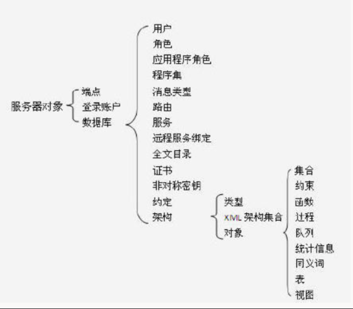

### postgre btree索引

btree索引可以处理 = < <= >= > is null、 is not null 、like xxx%、in、=any，不能用来处理!= 、not in

### MsSql根据主外键获取信息

`select t.object_id,t.name,SCHEMA_NAME(o.schema_id) as [schema],o.name from sys.indexes t join sys.objects o  on t.object_id = o.object_id where t.name = 'PK_GuardianshipConservatorshipPlan'`

### MsSql获取表的constraint信息

`select name  
from  sys.foreign_key_columns f join sys.objects o on f.constraint_object_id=o.object_id 
where f.parent_object_id=object_id('ReportModule.Subscription')`

### MsSql结构

