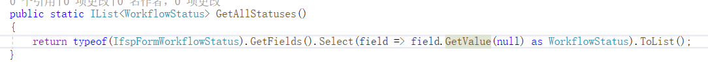
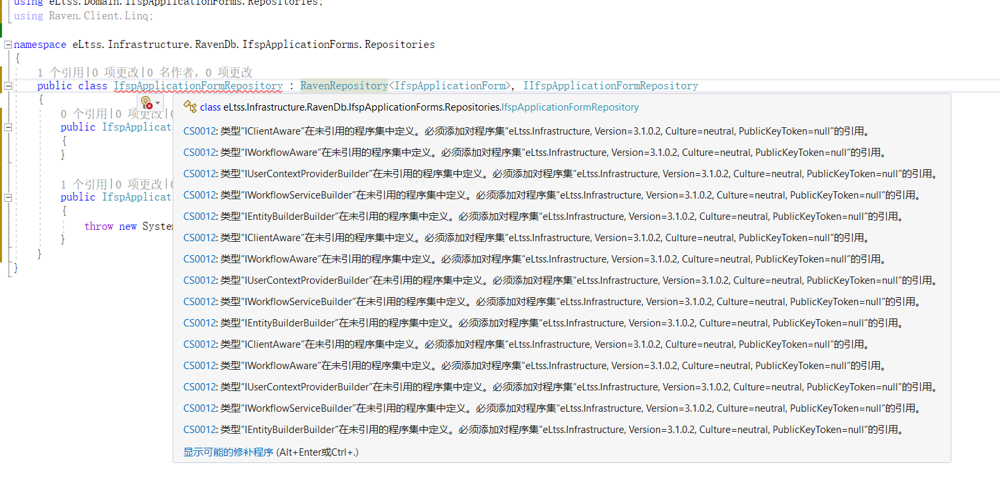
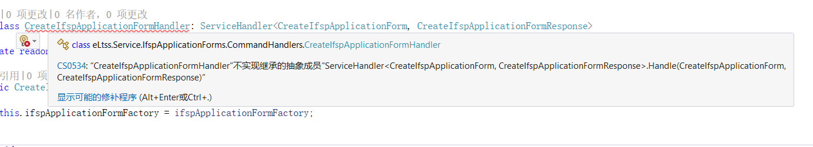

- George.Parker SystemTEST!001
- word帐号：A6174@lllkj.onmicrosoft.com 密码：Woq66052
- metadata rule触发条件：当前view model包含这个model且这个model!=null
- Annual Leave、SVCCTR.OVR.CMG.LEA
  * 元旦 1天 New Year's Day
  * 春节 3天 the Spring Festival
  * 端午节 1天 the Dragon Boat Festival
  * 中秋节 1天 the Mid-autumn Festival
  * 清明节 1天 the Tomb-sweeping Festival
  * 国庆节 3天 National Day
  * 五一 1天 May Day
- host :C:\Windows\System32\drivers\etc
- 香港账号 njhska@126.com Wyj@498921982
- waitlist: 006664   07/01/1965  895566654322
- "C:\Program Files (x86)\Microsoft\Edge\Application\msedge.exe" --disable-web-security --user-data-dir=C:\MyEdgeDevUserData

# 重要性依次递减

## 健康

- 眼睛
  - 30分钟休息眼睛
  - 不在床上使用手机
  - 不在暗环境使用手机
- 腰和脖子
  - 坐一个小时要起来伸展身体和活动脖子
  - 正确的坐姿
  - 二郎腿放下
- 吃饭
  - 吃饭要半饱，尤其是晚饭
  - 零食拒绝干类 辣的
  - 少吃肥肉
  - 多喝水 多吃水果
- 运动
  - 跑步去 5：30-7：00

## 生活

- 和媳妇
  - 多交流而不是看手机
  - 一起跑步
  - 多亲密
    - 多亲亲抱抱
    - 多doi
    - 增加性趣味（买个玩具）
  - 出去游玩
- 和父母
  - 多交流
  - 交换身份尝试理解
- 和妞妞
  - 多带带

## 工作

- 尽快完成工作而不是拖延
- 认真听会议 录屏 笔记，而不是询问
- 多发邮件

## 学习

- 学习首先是为了更好的完成工作
  - 在工作中遇到难点疑点去扩散，并形成笔记
  - 多跟断点 了解工作框架底层的逻辑
  - 总结
- 学习是为了不被淘汰（下边是学习顺序，水滴石穿）
  - 架构学习
    - react.js 看视频
    - .net core 看视频
    - 做笔记 跟着敲代码
  - 基础学习
    - js基础再重新看一遍
    - c#几本书看完
    - 数据结构
    - 设计模式

# 工作遇到的问题

