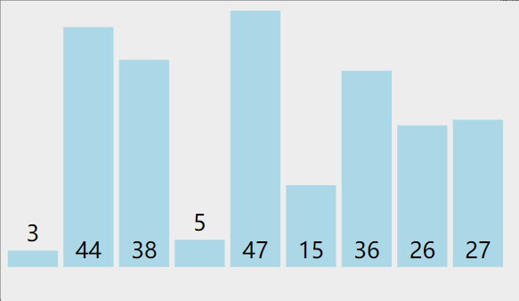
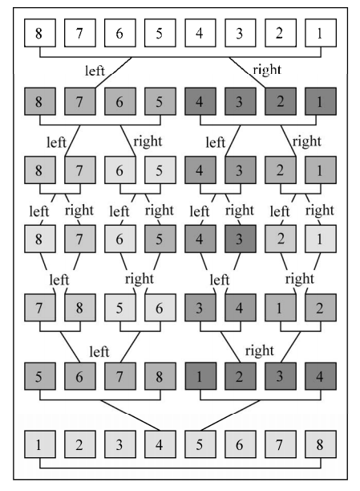

## 数据结构

### 链表

```javascript

class Node{

    constructor(value){

        this.value=value;

        this.next=null;

    }

}


class LinkList{

    item=[];

    length=0;

    head=null;

    append(value){

        let node=new Node(value);

        let current=null;

        if(this.head===null){

            this.head=node;

        }else{

            current=this.head;

            while(current.next){

                current=current.next;

            }

            current.next=node;

        }

        this.length++;

    }

    removeAt(position){

        if(position>=0&&position<this.length){

            let current=this.head;

            if(position===0){

                this.head=current.next;

            }else{

                let index=0;

                let previous=null;

                while(index++<position){

                    previous=current;

                    current=current.next;

                }

                previous.next=current.next;

            }

            this.length--;

            return current.value;

        }

        returnnull;

    }

    get(position){

        if(position>=0&&position<this.length){

            let current=this.head;

            let index=0;

            while(index++<position){

                current=current.next;

            }

            return current.value;

        }

        returnnull;

    }

    insert(position,value){

        if(position>=0&&position<this.length-1){

            let node=new Node(value);

            let current=this.head;

            if(position===0){

                node.next=current;

                this.head=node;

            }else{

                let previous=null;

                let index=0;

                while(index++<position){

                    previous=current;

                    current=current.next;

                }

                previous.next=node;

                node.next=current;

            }

            this.length++;

            returntrue;

        }

        returnfalse;

    }

    indexOf(value){

        let current=this.head;

        let index=0;

        while(current){

            if(current.value===value){

                return index;

            }

            index++;

            current=current.next;

        }

        return -1;

    }

}

```

### 最简单的hashtable

```javascript

class HashTable{

    items=[];

    hashcode(key){

        let hash=5381;//比较大的质数

        for(let i=0;i<key.length;i++){

            hash=hash*33 + key.charCodeAt(i);

        }

        return hash%1013;//0-1013

    }

    put(key,value){

        let hashKey=this.hashcode(key);

        this.items[hashKey]=value;

    }

    get(key){

        let hashKey=this.hashcode(key);

        returnthis.items[hashKey]

    }

    remove(key){

        let hashKey=this.hashcode(key);

        this.items[hashKey]=undefined;

    }

}


```

### 二叉树

```javascript

class Node{

    constructor(value){

        this.value=value;

        this.left=null;

        this.right=null;

    }

}


class BinarySearchTree{

    root=null;

    insertNode=(node,newNode)=>{

        if(newNode.value<node.value){

            if(node.left===null){

                node.left=newnode;

            }else{

                this.insertNode(node.left,newNode);

            }

        }else{

            if(node.right===null){

                node.right=newNode;

            }else{

                this.insertNode(node.right,newNode);

            }

        }

    }

    inOrderTraverseNode=(node,callback)=>{

        if(node!==null){

            inOrderTraverseNode(node.left,callback);

            callback(node);

            inOrderTraverseNode(node.right,callback);

        }

    }

    hasNode=(node,value)=>{

        if(node===null){

            returnfalse;

        }

        if(value<node.value){

            returnthis.hasNode(node.left,value);

        }elseif(value>node.value){

            returnthis.hasNode(node.right,value);

        }else{

            returntrue;

        }

    }

    minNode=(node)=>{

        if(node){

            while(node&&node.left){

                node=node.left;

            }

            return node;

        }

        returnnull;

    }

    removeNode=(node,value)=>{

        if(node===null){

            returnnull;

        }

        if(value<node.value){

            node.left=this.removeNode(node.left,value);

            return node;

        }elseif(value>node.value){

            node.right=this.removeNode(node.right,value);

            return node;

        }else{

            if(node.left===null&&node.right===null){

                node=null;

                return node;

            }

            if(node.left===null){

                node=node.left;

                return node;

            }

            if(node.right===null){

                node=node.right;

                return node;

            }

            let aux = this.minNode(node.right);

            node.value=aux.value;

            node.right=this.removeNode(node.right,aux.value);

            return node;

        }

    }

    insert(value){

        let node=new Node(value);

        if(this.root===null){

            this.root=node;

        }else{

            this.insertNode(this.root,node);

        }

    }

    inOrderTraverse(callback){

        inOrderTraverseNode(callback);

    }

    min(node){

        if(node){

            while(node&&node.left!==null){

                node=node.left;

            }

            return node.value;

        }

        returnnull;

    }

    max(node){

        if(node){

            while(node&&node.right){

                node=node.right;

            }

            return node.value;

        }

        returnnull;

    }

    has(value){

        returnthis.hasNode(this.root,value);

    }


}


```

### 排序

#### 冒泡排序



```javascript

function sort(arr){

    for(let i=0;i<arr.length;i++){

        for(let j=0;j<arr.length-i-1;j++){

            if(arr[j]>arr[j+1]){

                temp=arr[j];

                arr[j]=arr[j+1];

                arr[j+1]=temp;

            }

        }

    }

}

```

#### 选择排序


```javascript
function sort(arr){
    let minIndex;
    let temp;
    for(let i=0;i<arr.length;i++){
        minIndex=i;
        for(j=i+1;j<arr.length;j++){
            if(arr[minIndex]>arr[j]){
                minIndex = j;
            }
        }
        temp=arr[i];
        arr[i]=arr[minIndex];
        arr[minIndex]=temp;
    }
}
```

#### 插入排序


```javascript
function sort(arr){
    let j,temp;
    for(let i=1;i<arr.lengh;i++){
        j=i;
        temp=arr[i];
        while(j>0&&arr[j]<arr[j-1]){
            arr[j]=arr[j-1];
            j--
        }
        arr[j]=temp;
    }
}
```

#### 归并排序



```javascript
function mergeSort(arr){
    let length=arr.length;
    if(length===1){
        console.log(arr);
        return arr;
    }

    let mid=Math.floor(length/2);
    let left=arr.slice(0,mid);
    let right=arr.slice(mid,length);
    console.log("left",left);
    console.log("right",right);
    return merge(mergeSort(left),mergeSort(right));
}

function merge(left,right){
    let li=0;
    let ri=0;
    let result=[];
    while(li<left.length&&ri<right.length){
        if(left[li]>right[ri]){
            result.push(right[ri++]);
        }else{
            result.push(left[li++]);
        }
    }

    while(li<left.length){
        result.push(left[li++]);
    }
    while(ri<right.length){
        result.push(right[ri++]);
    }
    console.log(result);
    return result;
}

let r = mergeSort([3,4,2,7,1,5,9,6]);
console.log(r);
```

### 查找

#### 二分查找

```javascript
function binarySearch(item, arr) {
  arr = arr.sort();
  let low = 0;
  let high = arr.length - 1;
  let mid, element;
  while (low <= hight) {
    mid = Math.floor((hight + low) / 2);
    element = arr[mid];
    if (element > item) {
      high = mid - 1;
    } else if (element < item) {
      low = mid + 1;
    } else {
      return mid;
    }
  }
  return -1;
}

```
