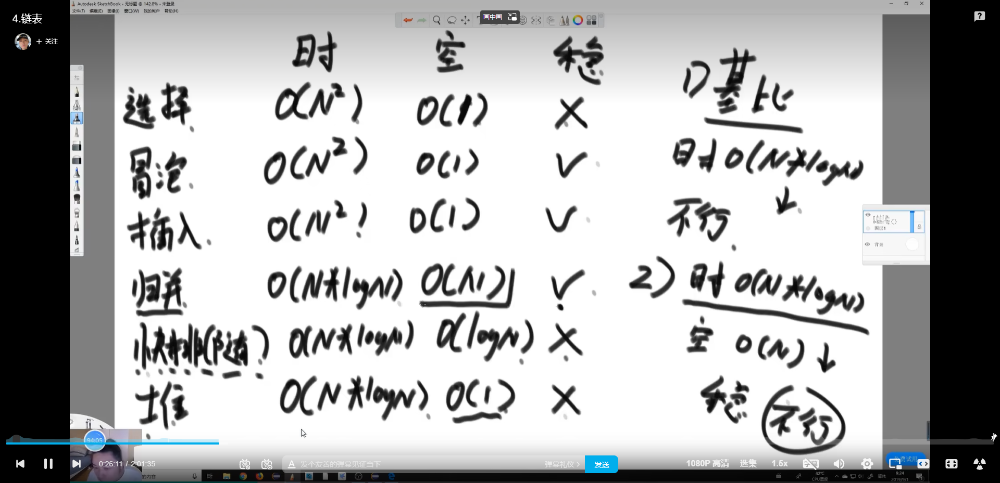
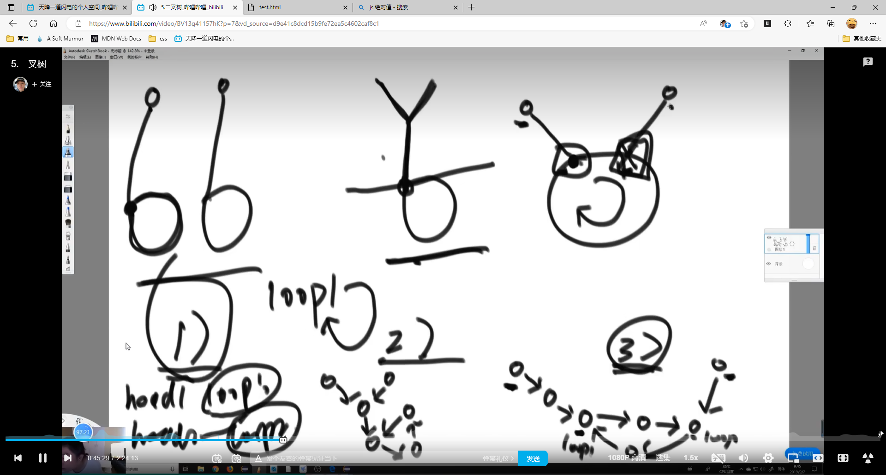
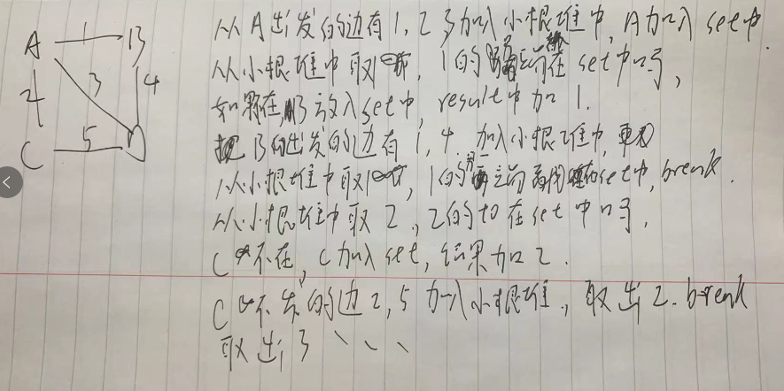
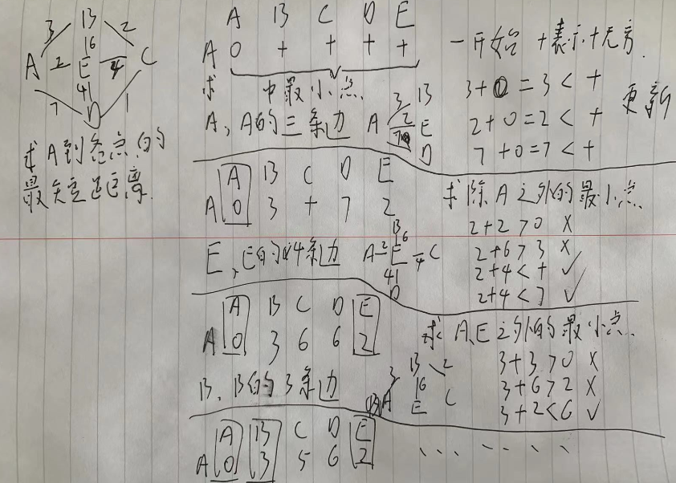

## 概念



### 时间复杂度

常数操作 跟数据量无关的固定时间的操作

事件复杂的指，进行多少次常数操作

用O 表示:

an^2+bn+c 这样的时间复杂度到数据量很大的时候~=n^2 因此an^2+bn+c的的O表示为 O(n^2)

### 空间复杂度

额外的几个变量O(1)

额外的相同规模的数组O(n)

### master公式

t(n)=a*t(n/b)+o(n^d);

- t(n) 递归的时间复杂度
- n 递归的规模
- n/b 指递归的子过程的规模都是n/b
- a 有几个子过程
- o(n^d) 其他运算的时间复杂度

master公式求解之后的结果

- 当log{b}a>d时，递归时间复杂度为O(n^d)
- 当log{b}a<d时,递归时间复杂度为O(n^(log{b}(a)))
- 当log{b}a=d时,递归时间复杂度为O(n^d*log(n))

## 堆结构

就是用数组实现完全二叉树，把数组从下标为0开始的项依次放入完全二叉树中

- size 从0开始的几个数
- i位置的左子树下标 2i+1,右子树下标2i+2
- i位置的父下标(i-1)/2
- 堆的高度 log(size)

### 优先队列

```javascript
class PriorityQueue{
    constructor(compare){
        this.items=[];
        this.compare=compare;
    }

    get size(){
        return this.items.length;
    }

    isEmpty(){
        return this.items.length == 0;
    }

    peek() {
        return this.items[0];
    }

    add(item){
        let index=this.items.length;
        this.items.push(item);
        while(true){
            let parentIndex=Math.trunc((index-1)/2);
            if(this.compare(this.items[index],this.items[parentIndex])){
                this.swap(index,parentIndex);
                index=parentIndex;
            }else{
                break;
            }
        }
    }

    pop(){
        let result=this.items.at(0);
        this.swap(this.items.length-1,0);
        this.items.length--;
        let index=0;
        while(true){
            let left=2*index+1;
            let minIndex;
            if(left<this.items.length){
                let right=2*index+2;
                minIndex = right<this.items.length && this.compare(this.items[right],this.items[left])?right:left;
                if(this.compare[this.items[minIndex],this.items[index]]){
                    break;
                }else{
                    this.swap(index,minIndex);
                    index=minIndex;
                }
            }else{
                break;
            }
        }
        return result
    }

    swap(x,y){
        let temp=this.items[x];
        this.items[x]=this.items[y];
        this.items[y]=temp;
    }
}

let p=new PriorityQueue((x,y)=>x-y<0);
p.add(4);
p.add(6);
p.add(2);
p.add(7);
while(!p.isEmpty()){
    console.log(p.pop());
}
```

### 给一组数求中位值

设大小两个根堆

第一个数放大根堆里

下个数>=大根堆堆顶 放入小根堆

两个根堆size相差2 转一个数到另外一个去

循环上面步骤，哪个堆多返回谁的顶部，一样则返回两个堆的堆顶平均值

```javascript
function dosth(arr){
    let p1=new PriorityQueue((x,y)=>x<y);
    let p2=new PriorityQueue((x,y)=>x>y);
    p2.add(arr[0])
    for(let i=1;i<arr.length;i++){
        let x=arr[i];
        if(i>=p2.peek()){
            p1.add(i);
        }else{
            p2.add(i);
        }
        let y;
        if(p1.size-p2.size==2){
            y=p1.pop();
            p2.add(y);
        }
        if(p2.size-p1.size==2){
            y=p2.pop();
            p1.add(y);
        }
    }
    if(p1.size>p2.size){
        return p1.peek();
    }else if(p2.zie>p1.size){
        return p2.peek();
    }else{
        return (p1.peek()+p2.peek())/2;
    }
}
```

## 排序题目

### 取!=0的数的最左边为1的数

```javascript
    function f(num){
        if(num==0) return;
        return num&(~num+1);
    }
```

### 一个数组中有且只有一个数出现了奇数次，求这个数

```javascript
    function f(arr){
        let tem=0;
        for(let i of arr){
            tem=tem^i;
        }
        return tem;
    }
```

### 一个数组中有且只有两个数出现了奇数次，求这两个数

```javascript
function f(arr){
    let t=0;
    for(let i of arr){
        t^=i;
    }
    let leftOne=t&(~t+1);
    let t1=0;
    for(let i of arr){
        if(i&leftOne==0){
            t1^=i;
        }
    }
    let t2=t^t1;
    return [t1,t2];
}
```

### 选择排序

```javascript
    function f(arr) {
        for (let i = 0; i < arr.length-1; i++) {
            let minIndex = i;
            for (let j = i + 1; j < arr.length; j++) {
                if (arr[j] < arr[minIndex]) {
                    minIndex = j;
                }
            }
            if(i!=minIndex){
                swap(arr,i,minIndex);
            }
        }
        return arr;
    }
    function swap(arr, a1, a2) {
        arr[a1]=arr[a1]^arr[a2];
        arr[a2]=arr[a1]^arr[a2];
        arr[a1]=arr[a1]^arr[a2];
    }
```

### 冒泡排序

```javascript
    function f(arr) {
        for (let i = arr.length - 1; i > 0; i--) {
            for (let j = 0; j < i; j++) {
                if (arr[j] > arr[j + 1]) {
                    swap(arr, j, j + 1);
                }
            }
        }
        return arr;
    }
    function swap(arr, a1, a2) {
        arr[a1] = arr[a1] ^ arr[a2];
        arr[a2] = arr[a1] ^ arr[a2];
        arr[a1] = arr[a1] ^ arr[a2];
    }
```

### 插入排序

时间复杂度

- 最差 O(n^2)
- 最好 O(n)
- 但是时间复杂度要取最差结果

```javascript
    function f(arr) {
        for(let i=1;i<arr.length;i++){
            for(let j=i;j>0;j--){
                if(arr[j]<arr[j-1]){
                    swap(arr,j,j-1);
                }else{
                    break;
                }
            }
        }
        return arr;
    }
    function swap(arr, a1, a2) {
        arr[a1] = arr[a1] ^ arr[a2];
        arr[a2] = arr[a1] ^ arr[a2];
        arr[a1] = arr[a1] ^ arr[a2];
    }
```

### 二分查找的时间复杂度是logn 有序数组

```javascript
function f(arr,num){
    let r=arr.length;
    let l=0;
    while(r>=l){
        let mid=l+((r-l)>>1);
        if(arr[mid]>num){
            r=mid;
        }else if(arr[mid]<num){
            l=mid+1;
        }else{
            return mid;
        }
    }
    return undefined;
}
```

### 有序数组查>=某个数的最左位置

或者<=某个数的最右位置

```javascript
    function f(arr,n){
        let left=0;
        let right=arr.length;
        while(right>left){
            let mid=left+(right-left)>>1;
            if(arr[mid]>=num){
                right=mid;
            }else{
                left=mid+1;
            }
        }
        return left;
    }
```

### 求相邻不等的数组的一个小范围最小值

```javascript
function f(arr){
        if(arr==null||arr.length==0){
            return;
        }
        if(arr.length==1){
            return 0;
        }
        let l=0;
        let r=arr.length-1;
        if(arr[l]<arr[l+1]){
            return l;
        }
        if(arr[r]<arr[r-1]){
            return r;
        }
        let mid=0;
        while(r>l){
            mid=l+((r-l)>>1);
            if(arr[mid]<arr[mid+1]&&arr[mid]<arr[mid-1]){
                return mid;
            }else if(arr[mid]>arr[mid-1]){
                r=mid;
            }else if(arr[mid]>arr[mid+1]){
                l=mid+1;
            }
        }
        return mid;
    }

    let n=f([9,4,3,4,1,6,9]);
    console.log(n);
```

### 求数组一定范围内的最大值，用递归

```javascript
function f(arr,l,r){
    if(l==r){
        return arr[l];
    }
    let mid=l+(r-l)>>1;
    let leftMax=f(arr,l,mid);
    let rightMax=f(arr,mid+1,r);
    return Math.max(leftMax,rightMax);
}
```

### 归并排序

时间复杂度

master公式 a=2 b=2 d=1

log{b}(a)==1 因此时间复杂度为n*log(n)

```javascript
function f(arr,l,r){
    if(l==r){
        return [arr[l]];
    }
    let mid=l+((r-l)>>1);
    let leftArr=f(arr,l,mid);
    let rightArr=f(arr,mid+1,r);
    return merge(leftArr,rightArr);
}
function merge(leftArr,rightArr){
    let result=[];
    let i=0;
    let j=0;
    while(i<leftArr.length&&j<rightArr.length){
        if(leftArr[i]<=rightArr[j]){
            result.push(leftArr[i]);
            i++
        }else{
            result.push(rightArr[j]);
            j++;
        }
    }
    while(i<leftArr.length){
        result.push(leftArr[i]);
        i++;
    }
    while(j<rightArr.length){
        result.push(rightArr[j]);
        j++;
    }
    return result;
}
let arr=f([4,2,6,7,45,7,9],0,6);
console.log(arr);
```

### 求小和

指一个数组中每个值左侧比它自身小的所有数的总和

```javascript
let sum=0;
function f(arr,l,r){
    if(l==r){
        return [arr[l]];
    }
    let mid=l+((r-l)>>1);
    let leftArr=f(arr,l,mid);
    let rightArr=f(arr,mid+1,r);
    return merge(leftArr,rightArr);
}
function merge(leftArr,rightArr){
    let result=[];
    let i=0;
    let j=0;
    while(i<leftArr.length&&j<rightArr.length){
        if(leftArr[i]<rightArr[j]){
            result.push(leftArr[i]);
            sum+=leftArr[i]*(rightArr.length-j);
            i++;
  
        }else{
            result.push(rightArr[j]);
            j++;
        }
    }
    while(i<leftArr.length){
        result.push(leftArr[i]);
        i++;
    }
    while(j<rightArr.length){
        result.push(rightArr[j]);
        j++;
    }   
    return result;
}
let arr=f([1,4,3,2,5],0,4);
console.log(arr);
console.log(sum);
```

### 给定一个数组和一个数，把数组变为左边部分都是<=该数，右边都是大于该数的样子

```javascript
function f(arr,num){
    let i=-1;let j=0;
    while(j<arr.length){
        if(arr[j]<=num){
            if(i+1!=j){
                swap(arr,i+1,j);
            }
            i++;
        }
        j++;
    }
    return arr;
}
function swap(arr,i,j){
    arr[i]=arr[i]^arr[j];
    arr[j]=arr[i]^arr[j];
    arr[i]=arr[i]^arr[j];
}
let arr=f([3,5,8,9,2,5,6,4,9],5);
console.log(arr);
```

### 给定一个数组和一个数，把数组变为左边部分都是<该数，中间=该数，右边都是大于该数的样子

```javascript
    function f(arr, num) {
        let leftIndex = -1;
        let rightIndex = arr.length;
        let index = 0;
        while (index != rightIndex) {
            if (arr[index] == num) {
                index++
            } else if (arr[index] > num) {
                if (index != rightIndex - 1) {
                    swap(arr, index, rightIndex - 1);
                }
                rightIndex--;
            } else {
                if (index != leftIndex + 1) {
                    swap(arr, index, leftIndex + 1);
                }
                leftIndex++;
                index++;
            }
        }
        return arr;
    }
    function swap(arr, i, j) {
        arr[i] = arr[i] ^ arr[j];
        arr[j] = arr[i] ^ arr[j];
        arr[i] = arr[i] ^ arr[j];
    }
    let arr = f([6, 5, 4, 8, 9, 12, 4, 3, 2, 17, 5], 5);
    console.log(arr);
```

### 快速排序

```javascript
    let num=0;
    function sort(arr,left,right){
        if(left<right){
            let mid=part(arr,left,right);
            console.log(`num${num++}:left:${left},right:${right},mid${mid}`);
            sort(arr,left,mid-1);
            sort(arr,mid+1,right);
        }
    }
    function part(arr,left,right){
        let start=left-1;
        let last=arr[right];
        let index=left;
        while(index<right){
            if(arr[index]<=last){
                swap(arr,index++,++start);
            }else{
                index++;
            }
        }
        swap(arr,++start,right);
        return start;
    }
    function swap(arr,a1,a2){
        let temp=arr[a1];
        arr[a1]=arr[a2];
        arr[a2]=temp;
    }
    let arr=[5,2,1,4,6,8,7,3,9,5];
    sort(arr,0,arr.length-1);
    console.log(arr);
```

### 大小根堆排序

```javascript
function heapInsert(arr,index){
    while(arr[index]>arr[(index-1)/2]){
        swap(arr,index,(index-1)/2);
        index=(index-1)/2;
    }
}
function heapify(arr,index,size){
    let left=index*2+1;
    while(left<size){
        let right=index*2+2;
        let largest=right<size&&arr[right]>arr[left]?right:left;
        if(arr[index]>=arr[largest]){
            break;
        }
        swap(arr,index,largest);
        index=largest;
        left=index*2+1;
    }
}
function heapSort(arr){
    for(let i=0;i<arr.length;i++){
        heapInsert(arr,i);
    }
    let size=arr.length;
    swap(arr,0,--size);
    while(size>0){
        heapify(arr,0,size);
        swap(arr,0,--size);  
    }
}
function swap(arr,i,j){
    let temp=arr[i];
    arr[i]=arr[j];
    arr[j]=temp;
}
```

### 排序一个接近排列好的数组，指数组中的每一项都离排好序不超过k

利用优先队列 控制时间复杂度在O(n*log(k))

```javascript
function f(arr,k){
    let queue=new PriorityQueue();
    for(let i=0;i<k;i++){
        queue.push(arr[i]);
    }
    let j=0;
    for(let i=k;i<arr.length;i++){
        arr[j] = queue.shift();
        queue.push(arr[i]);
        j++;
    }
    while(!queue.isEmpty){
        arr[j]=queue.shift();
        j++;
    }
}
```

### 时间复杂度为O(n)的排序

```javascript
    function f(arr){
        let map=[0,0,0,0,0,0,0,0,0,0];
        for(let i of arr){
            map[i]++;
        }
        let index=0;
        for(let i=0;i<map.length;i++){
            for(let j=0;j<map[i];j++){
                arr[index++]=i;
            }
        }
    }

    let arr=[3,8,4,9,4,0,1,2,5];
    f(arr);
    console.log(arr);
```

### 桶排序

```javascript
function sort(arr){
    //桶排序 也叫基数排序
    let temp=new Array(arr.length);
    let digit=getMaxDigit(arr);
    //统共需要进出桶digit次
    for(let i=0;i<digit;i++){
        let count=new Array(10).fill(0);
        //统计arr每个数digit位出现的频率
        for(let j=0;j<arr.length;j++){
            let c=getDigit(arr[j],i);
            count[c]++;
        }
        //把频率表转化成<=digit位出现的频率
        for(let i=1;i<10;i++){
            count[i]=count[i]+count[i-1];
        }
        //arr中后边的数后入桶，所以从后边循环
        //在出桶的时候应该放到哪个位置
        for(let j=arr.length-1;j>=0;j--){
            let c=getDigit(arr[j],i);
            temp[count[c]-1]=arr[j];
            count[c]--;
        }
        for(let j=0;j<temp.length;j++){
            arr[j]=temp[j];
        }
    }
}
//获取数组中最大值有多少位
function getMaxDigit(arr){
    let max=Number.MIN_VALUE;
    for(let i of arr){
        max=Math.max(i,max);
    }

    let result=0;
    while(max!=0){
        result++;
        max=Math.trunc(max/10);
    }
    return result;
}
//获取num在digit的位上的值
function getDigit(num,digit){
    return (Math.trunc((num/Math.pow(10,digit)))%10);
}

let arr=[98,67,100,1,6,4,99,101,34];
sort(arr);
console.log(arr);
```

## 链表题目

### 链表

```javascript
class Node {
    constructor(value) {
        this.value = value;
        this.next = null;
        this.pre = null;
    }
    //返回首尾
    static help(arr) {
        let head = new Node(arr[0]);
        let result = head;
        for (let i = 1; i < arr.length; i++) {
            let node = new Node(arr[i]);
            head.next = node;
            head = node;
        }
        return [result,head];
    }
}
```

### 反转链表

```javascript
class Node {
    constructor(value) {
        this.value = value;
        this.next = null;
        this.pre = null;
    }
}

function reverseDoubleLinkList(head) {
    let current = head;
    while (current.next) {
        current.pre=current.next;
        current = current.next;
    }
    current.pre=null;

    current = head;
    let pre = null;
    while (current.pre) {
        current.next = pre;
        pre = current;
        current = current.pre;
    }
    current.next = pre;
    return current;
}

function reverseLinkList(head) {
    let current = head;
    let pre = null;
    while (current != null) {
        let temp = current.next;
        current.next = pre;
        pre = current;
        current = temp;
    }
    return pre;
}
//使用递归反转单链表
function dosth(current, pre) {
    if (current == null) return pre;
    let temp = current.next;
    current.next = pre;
    dosth(temp, current);
}
```

### 有序链表怎么找到中点

利用快慢指针

```javascript
function findMid(head){
    let fast=head;
    let slow=head;
    //slow到中间或者中间前一位
    // while(fast!=null&&fast.next!=null&&fast.next.next!=null){
    //     slow=slow.next;
    //     fast=fast.next.next;
    // }
    //slow到中间或者中间后一位
    while(fast!=null&&fast.next!=null){
        slow=slow.next;
        fast=fast.next.next;
    }
    return slow.value;
}
```

### 如何判断链表是否为回文结构

空间复杂度O(n)写法

```javascript
//使用栈
function dosth(head){
    let arr=[];
    let cur=head;
    while(cur){
        arr.push(cur.value);
        cur=cur.next;
    }
    cur=head;
    let index=arr.length-1;
    while(cur){
        if(cur.value!=arr[index]){
            return false;
        }
        index--;
        cur=cur.next;
    }
    return true;
}
```

空间复杂度O(1)写法

```javascript
function dosth(head){
    let fast=head;
    let slow=head;
    //找到中点
    while(fast?.next?.next){
        slow=slow.next;
        fast=fast.next.next;
    }
    //从中点到最后逆序
    let anotherHead=reverseLinkList(slow);
    let last=anotherHead;
    let first=head;
    let result=true;
    //从首位两侧迭代链表判断两侧值是否相等
    while(first){
        if(first.value!=last.value){
            result=false;
        }
        first=first.next;
        last=last.next;
    }
    reverseLinkList(anotherHead);
    return result;
}

function reverseLinkList(head){
    let cur=head;
    let pre=null;
    while(cur){
        let temp=cur.next;
        cur.next=pre;
        pre=cur;
        cur=temp;
    }
    return pre;
}
```

### 吧链表更新为根据某个值的区间链表，小于这个值放左边，等于放中间，大于放右边

空间复杂度为O(1)

```javascript
function dosth(head,num){
    //创建小于 等于 大于三个链表的头跟尾
    let sh=null,st=null,eh=null,et=null,bh=null,bt=null;
    let current=head;
    //遍历链表
    //分别加到合适的链表中
    while(current){
        if(current.value<num){
            if(!sh){
                sh=current;
                st=current;
            }else{
                st.next=current;
                st=current;
            }
        }else if(current.value>num){
            if(!bh){
                bh=current;
                bt=current;
            }else{
                bt.next=current;
                bt=current;
            }
        }else{
            if(!eh){
                eh=current;
                et=current;
            }else{
                et.next=current;
                et=current;
            }
        }
        current=current.next;
    }
    //三个链表首位相连
    if(st&&eh){
        st.next=eh;
    }
    if(et&&bh){
        et.next=bh;
    }
}

let head=Node.help([3,4,1,2,6,5,7,9]);
dosth(head,6);
while(head){
    console.log(head.value);
    head=head.next;
}


```

### 链表是否自环

空间复杂度O(n)

```javascript
function isSurround(head){
    let set=new Set();
    let current=head;
    while(current){
        //通过遍历 依次放入set 如果向set中再次添加 自环
        if(set.has(current)){
            return current;
        }else{
            set.add(current);
        }
        current=current.next;
    }
}
```

空间复杂度O(1)

```javascript
function isSurround(head) {
    if (head?.next?.next == null) return null;
    let fast = head.next;
    let slow = head.next.next;
    //是否环绕 如果fast能走完都没跟slow遇见说明不是环绕
    while (fast != slow) {
        if (fast?.next?.next == null) return null;
        slow = slow.next;
        fast = fast.next?.next;
    }
    fast = head;
    while (fast != slow) {
        slow = slow.next;
        fast = fast.next;
    }

    return fast;
}
```

### 两个有终点(无环绕)链表是否相交

```javascript
function isCross(h1,h2){
    let cur1=head1;
    let cur2=head2;
    let n=0;
    //两个链表走到终点
    //如果终点不相等 肯定不相交
    while(cur1){
        n++;
        cur1=cur1.next;
    }
    while(cur2){
        n--;
        cur2=cur2.next;
    }
    if(cur1!=cur2){
        return null;
    }
    //如果相交 相交之前长度不一致 计算出长度差值
    //先走完长链表的差值部分
    if(n>0){
        cur1=head1;
        cur2=head2;
    }else{
        cur1=head2;
        cur2=head1;
    }
    n=Math.abs(n);
    while(n!=0){
        cur1=cur1.next;
        n--;
    }
    while(cur1!=cur2){
        cur1=cur1.next;
        cur2=cur2.next;
    }
    return cur1;
}

let [head1,tail1]=Node.help([1,2,3,4,5]);
let [head2,tail2]=Node.help([1,2,3]);
let [head3,tail3]=Node.help([8,9]);
tail1.next=head3;
tail2.next=head3;
let c= isCross(head1,head2);
console.log(c);
```

### 两个环绕链表是否相交



- 找到两个链表各自的环绕点
- 如果相等就是情况2
  - 把环绕节点作为尾部
  - 按求无环绕链表相交的方式求相交点
- 如果不相等
  - 让一个环绕点继续向下，如果回到自己都碰不到另外一个环绕点就是情况1
  - 如果碰到了就是情况3
  - 返回两个环绕点任意一个就是相交点

## 二叉树题目

```javascript
class Node{
    constructor(value){
        this.value=value;
        this.left=null;
        this.right=null;
    }
    static createTree(arr){
        let l=arr.length;
        let nodeArr=[];
        for(let i=0;i<l;i++){
            nodeArr.push(new Node(arr[i]));
        }
        for(let i=0;i<l;i++){
            let node=nodeArr[i];
            if((2*i+1)<l){
                node.left=nodeArr[2*i+1];
            }
            if((2*i+2)<l){
                node.right=nodeArr[2*i+2];
            }
        }
        return nodeArr[0];
    }
}
```

### 递归遍历

- 先序 处理第一次相遇 头-左-右
- 中序 处理第二次相遇 左-头-右
- 后序 处理第三次相遇 左-右-头

```javascript
function dosth(node){
    if(node==null){
        return;
    }
    //这里是第一次处理node
    dosth(node.left);
    //在这里第二次处理node
    dosth(node.right);
    //在这里第三次处理node
}
```

### 栈遍历

```javascript
function preOrder(node){
    //把头压入栈中
    let stack=[node];
    while(stack.length){
        //当栈不为空时，弹出一项
        //把它的右左依次压入栈中
        let cur=stack.pop();
        console.log(cur.value);
        if(cur.right){
            stack.push(cur.right);
        }
        if(cur.left){
            stack.push(cur.left);
        }
    }
}

//后顺序为修改压栈的顺序为左右 弹出为右左
//把他们都压入备用栈中
function posOrder(node){
    let stack=[node];
    let temp=[];
    while(stack.length){
        let cur=stack.pop();
        temp.push(cur);
        if(cur.left){
            stack.push(cur.left);
        }
        if(cur.right){
            stack.push(cur.right);
        }
    }
    for(let i=temp.length-1;i>=0;i--){
        console.log(temp[i].value);
    }
}

function inOrder(node){
    let stack=[];
    let cur=node;
    while(stack.length||cur){
        if(cur){
            stack.push(cur);
            cur=cur.left;
        }else{
            cur = stack.pop();
            console.log(cur.value);
            cur=cur.right;
        }
    }
}


```

### 逐层遍历

```javascript
function levelOrder(node){
    //把头放入队列中 1
    //从队列中取出一个 2
    //把取出来的左右依次放入队列中 3
    //重复 2 3
    let arr=[node];
    while(arr.length){
        let cur = arr.shift();
        console.log(cur.value);
        if(cur.left){
            arr.push(cur.left);
        }
        if(cur.right){
            arr.push(cur.right);
        }
    }
}
```

### 求树的最大宽度

```javascript
function dosth(node) {
    //使用逐层遍历
    //使用map 记录每个node的层数
    //在统计map的信息
    let arr = [node];
    let map = new Map();
    map.set(node, 1);
    let maxLevelCount = 0;
    let preLeve = 0;
    let curLevelCount = 1;
    while (arr.length) {
        let cur = arr.shift();
        let curLevel = map.get(cur);
        if (preLeve == curLevel) {
            curLevelCount++;
        } else {
            maxLevelCount = Math.max(curLevelCount, maxLevelCount);
            curLevelCount = 1;
        }
        preLeve=curLevel;
        if (cur.left) {
            map.set(cur.left, curLevel + 1);
            arr.push(cur.left);
        }
        if (cur.right) {
            map.set(cur.right, curLevel + 1);
            arr.push(cur.right);
        }
    }

    return Math.max(curLevelCount, maxLevelCount);
}

let head = Node.createTree([1, 2, 3, 4, 5, 6, 7]);
console.log(levelOrder(head)); 
```

### 判断是否为搜索二叉树

搜索二叉树 ：若它的左子树不空，则左子树上所有结点的值均小于它的根节点的值； 若它的右子树不空，则右子树上所有结点的值均大于它的根结点的值

闭包方式

```javascript
function dosth(node) {
    let min = Number.MIN_VALUE;
    let isSort = true;
    //使用递归的方式中序遍历
    //判断是否比上一次的值大
    //比上次的小则不是搜索树
    function loop(node) {
        if (!node) {
            return null;
        }
        loop(node.left);
        if (node.value > min) {
            min = node.value;
        } else {
            isSort = false;
        }
        loop(node.right);
    }
    loop(node);
    return isSort;
}
```

栈方式

```javascript
//使用栈的方式中序遍历
//判断是否比上一次的值大
//比上次的小则不是搜索树
function inOrderCheck(node) {
    let min = Number.MIN_VALUE;
    let arr = [];
    let cur = node;
    while (arr.length || cur) {
        if (cur) {
            arr.push(cur);
            cur = cur.left;
        } else {
            cur = arr.pop();
            //处理
            if (cur.value > min) {
                min = cur.value;
            } else {
                return false;
            }
            cur = cur.right;
        }
    }
    return true;
}
```

```javascript
//判断是否为搜索二叉树
function dosth(node){
    if(!node){
        return null;
    }

    let leftResult=dosth(node.left);
    let rightResult=dosth(node.right);

    let max=node.value;
    let min=node.value;
    if(leftResult){
        max=Math.max(max,leftResult.max);
        min=Math.min(min,leftResult.min);
    }
    if(rightResult){
        max=Math.max(max,rightResult.max);
        min=Math.min(min,rightResult.min);
    }
    let isSearch = true;
    if(leftResult&&(!leftResult.isSearch||leftResult.max>=node.value)){
        isSearch=false;
    }
    if(rightResult&&(!rightResult.isSearch||node.value>=rightResult.min)){
        isSearch=false;
    }

    return {isSearch,min,max};
}
```

### 判断是否为完全二叉树

- 使用逐层遍历
- 如果一个节点有右无左 那必定不是满二叉树
- 如果一个节点直接点不全，那么它之后的节点一定都是叶子节点

```javascript
function dosth(node){
    let arr=[node];
    let last=false;
    while(arr.length){
        let cur=arr.shift();
        //1如果一个节点无左有右 return false
        if(cur.right&&!cur.left){
            return false;
        }
        //最后一个节点之后都应该是叶子节点
        if(last){
            return !cur.left&&!cur.right;
        }
        //如果一个节点在1的情况下 且 没有左或者右 把它记为最后一个节点
        if(!cur.left||!cur.right){
            last=true;
        }

        if(cur.left){
            arr.push(cur.left)
        }
        if(cur.right){
            arr.push(cur.right);
        }
    }
}

```

### 判断是否为平衡二叉树

左子树和右子树的高度之差的**绝对值小于等于1**

观看视频   二叉树递归套路

```javascript
function dosth(node){
    if(!node){
        return {isBalance:true,height:0};
    }

    let leftResult=dosth(node.left);
    let rightResult=dosth(node.right);

    let height=Math.max(leftResult,rightResult)+1;
    let isBalance=leftResult.isBalance&&rightResult.isBalance&&Math.abs(leftResult.height-rightResult.height)<2;
  
    return {isBalance,height};
}
```

### 判断是否为满二叉树

满足 节点总数 = 2^高度-1

```javascript
function isFullTree(node){
    let result=dosth(node);
    //1左移几位相当于2的几次方
    return result.count == ((1<<result.height)-1);
}
//返回一棵树的高度和节点总数
function dosth(node){
    if(!node){
        return {height:0,count:0};
    }

    let leftResult=dosth(node.left);
    let rightResult=dosth(node.right);

    let height = Math.max(leftResult.height,rightResult.height)+1;
    let count=leftResult.count+rightResult.count+1;

    return {height,count};
}
```

### 找到一棵树的两个节点的最近公共祖先

map方式

```javascript
function main(node,o1,o2){
    let map=new Map();
    let set=new Set();
    map.set(node,null);
    dosth(node,map);
    //遍历o1的父节点放入set中
    let cur=o1;
    while(cur){
        cur=map.get(cur);
        set.add(cur);
    }
    cur=o2;
    //遍历o2的父节点 判断是否在set中存在 找到第一个存在的节点
    while(cur){
        cur=map.get(cur);
        if(set.has(cur)){
            return cur;
        }
    }
    return null;
}
//把节点作为键父节点作为值放入map中
function dosth(node,map){
    if(!node){
        return;
    }
    map.set(node.left,node);
    map.set(node.right,node);
    dosth(node.left,map);
    dosth(node.right,map);
}
```

递归方式

```javascript
//按两种情况分析
//o1是o2的父节点或者o2是o1的父节点
//o1 o2有共同的祖先节点
function dosth(node,o1,o2){
    if(node==null||node==o1||node==o2){
        return node;
    }
    let left=dosth(node.left,o1,o2);
    let right=dosth(node.right,o1,o2);

    if(left&&right){
        return node;
    }

    return left||right;
}
```

### 求中序排序中某个节点的后续节点

方法一，把树按中序添加到数组中，它在数组中的下个节点就是后续节点

方法二前提是在每个节点上都带有父节点

```javascript
function dosth(node){
    //如果该节点有右树，后续节点就是右树最左的节点
    if(node.right){
        let cur=node.right;
        while(cur){
            cur=cur.left;
        }
        return cur;
    }else{
        //如果该节点没有右树
        //如果我是父节点的左节点 后续节点就是父节点
        //否在就向上找，一直找到cur是父节点的左子树
        //那么该节点就是后续节点
        //如果找到最后也没找到  这说明这个节点是最右节点 没有后续
        let parent=node.parent;
        let cur=node;
        while(parent){
            if(parent.left==cur){
                return parent;
            }else{
                cur=parent;
                parent=parent.parent;
            }
        }
        return null;
    }
}
```

### 折纸问题

请把一段纸条竖着放在桌子上，然后从纸条的下边向上方对折1次，压出折痕后展开，折痕凹陷记为down，折痕凸起记为up。然后恢复对折后，再次对折，压出折痕后展开，依次类推
给定一个输入参数N，代表纸条都从下边向上方连续对折N次。
请从上到下打印所有折痕
例如：N=1时，打印：down   N=2时，打印：down down up

每次对折就会在上一次出现的折痕两边添加凹凸两个折痕，可以视为每次折叠都高度都增加1的满二叉树，每个节点左右节点一定是凹凸节点，头节点是凹节点。展开的样子是这棵树的中序迭代

```javascript
function dosth(i,n,down){
    if(i>n){
        return;
    }
    dosth(i+1,n,true);
    console.log(down?'凹':'凸');
    dosth(i+1,n,false);
}
```

### y一棵树的序列化与反序列化

```javascript
//二叉树dp
function serialize(node) {
    if (!node) {
        return '#_';
    }
    let res = node.value + '_';
    res += serialize(node.left);
    res += serialize(node.right);
    return res;
}
//把字符串放入数组中
function deSerialize(arr) {
    let v = arr.shift();
    if (v == '#') {
        return null;
    }
    let node = new Node(v);
    node.left = deSerialize(arr);
    node.right = deSerialize(arr);
    return node;
}
```

### dp补充

求一棵树上最远的两个节点距离

```javascript
function dosth(node){
    if(!node){
        return {maxHeight:0,maxDis:0};
    }
    let left=dosth(node.left);
    let right=dosth(node.right);

    let height=Math.max(left.maxHeight,right.maxHeight)+1;
    let maxDis=Math.max(left.maxDis,right.maxDis);
    let maxHeightDis=left.maxHeight+right.maxHeight+1;
    maxDis=Math.max(maxHeightDis,maxDis);

    return {maxDis:maxDis,maxHeight:height};
}
```


## 图题目

```javascript
class Graph{
    constructor(){
        //图包含节点的map key:节点id value:node
        this.nodes=new Map();
        //图包含边线的集合
        this.edges=[];
    }
}

class Node{
    constructor(value){
        this.value=value;
        //节点的入/出度
        this.in=0;
        this.out=0;
        this.nexts=[];
        //属于节点的边线
        this.edges=[];
    }
}

class Edge{
    constructor(weight,from,to){
        this.from=from;
        this.to=to;
        this.weight=weight;
    }
}
```

### 宽度优先搜索

```javascript
function dosth(node){
    let arr=[node];
    let set=new Set();
    set.add(node);
    while(arr.length){
        let cur=arr.shift();
        //处理该node
        for(let v of cur.nexts){
            if(!set.has(v)){
                arr.push(v);
                set.add(v);
            }
        }
    }
}
```

### 深度优先搜索

```javascript
function dosth(node){
    let arr=[];
    let set=new Set();
    arr.push(node);
    set.add(node);
    //添加到set中时处理它
    console.log(node.value);
    while(arr.length){
        let cur=arr.pop();
        for(let x of cur.nexts){
            if(!set.has(x)){
                arr.push(cur);
                arr.push(x);
                set.add(x);
                //添加到set中时处理它
                console.log(x.value);
                //碰到之前没有的node就break
                break;
            }
        }
    }
}
```

### 拓扑排序

适用范围:要求有向图，且有入度为0的节点，且没有环

```javascript
function dosth(graph){
    let zeroInQueue=[];
    let inNodes=new Map();
    for(let [key,node] of graph.nodes){
        //不修改图的情况下记录node的入度
        inNodes.set(node,node.in);
        if(node.in==0){
            zeroInQueue.push(node);
        }
    }
    while(zeroInQueue.length){
        let cur = zeroInQueue.shift();
        //处理node
        for(let node of cur.nexts){
            //修改所有next的入度-1
            inNodes.set(node,node.in--);
            if(inNodes.get(node) == 0){
                zeroInQueue.push(node);
            }
        }
    }
}
```

### 最短路线1


```javascript
class UnionSet{
    constructor(nodes){
        this.map=new Map();
        for(let x of nodes){
            this.map.set(x,new Set().add(x));
        }
    }
    isSameSet(from,to){
        return this.map.get(from) === this.map.get(to);
    }
    union(from,to){
        let fromSet =this.map.get(from);
        let toSet=this.map.get(to);
        for(let x of toSet){
            fromSet.add(x);
            this.map.set(x.fromSet);
        }
    }
}

function shortestLines(graph){
    let result=[];
    let unionSet=new UnionSet(graph.nodes.values());
    let edges=graph.edges.sort((x,y)=>y.weight-x.weight);
    for(let x of edges){
        if(!unionSet.isSameSet(x.from,x.to)){
            union(x.from,x.to);
            result.push(x);
        }
    }
    return result;
}


```

### 最短线路2



```javascript
function dosth(node){
    let result=[];
    let priorityQueue=new PriorityQueue((x,y)=>x.weight<y.weight);
    let set=new Set().add(node);
    for(let x of node.edges){
        priorityQueue.add(x);
    }
    while(!priorityQueue.isEmpty()){
        let cur=priorityQueue.pop();
        if(!set.has(cur.to)){
            result.push(cur);
            set.add(cur.to);
            for(let x of cur.to.edges){  
                priorityQueue.add(x);
            }
        }
    }
    return result;
}
```

### 最短距离问题



```javascript

function dosth(node){
    //key:其他节点 value:与node的最短距离
    let result=new Map();
    result.set(node,0);
    //已经选择过的节点
    let selected=new Set();
    let cur=getMinUnSelected(result,selected);
    while(cur){
        //cur距离node的距离
        let curDistance=result.get(cur);
        for(let edge of cur.edges){
            //如果result中没有to这个点到node是正无穷 修改这个点的距离为edge长度
            if(!result.has(edge.to)){
                result.set(edge.to,curDistance+edge.weight);
            }else{//如果result中有to这个点 判断result储存的值和node-cur的距离+cur到to的距离哪个是最小的
                let distance=result.get(edge.to);
                result.set(edge.to,Math.min(distance,curDistance+edge.weight));
            }
        }
        selected.add(cur);//cur这个点就可以排除了
        cur=getMinUnSelected(result,selected);
    }
    return result;
}

function getMinUnSelected(map,set){
    let min={weight:Number.MAX_VALUE};
    for(let [x] of map){
        //如果x没有在set中，且x最小 返回x
        if(!set.has(x)&&x.weight<min.weight){
            min=x;
        }
    }
    return min;
}
```

## 贪心算法题目

### 一定时间段内，尽量多的安排不同时间段的会议

```javascript
function dosth(arr,start,end){
    let result=[];
    //策略：end在前的先考虑，避免时间重叠
    arr.sort((x,y)=>x.end-y.end);
    for(let x of arr){
        if(x.end>end){
            break;
        }
        if(x.start>=start){
            result.push(x);
            start=x.end;
        }else{
            continue;
        }
    }
    return result;
}

let result=dosth([
    {start:6,end:8},
    {start:7,end:9},
    {start:8,end:11},
    {start:10,end:13},
    {start:12,end:14},
    {start:15,end:17},
    {start:16,end:18},
    {start:14.5,end:17}
],6,18);
console.log(result);
```

### 单词数组 按字典序排序组合

```javascript
function dosth(arr){
    arr.sort((x,y)=>(x+y)-(y+x));
    return arr.join('');
}

let str=dosth(['abc','ab','de','fa','ac']);
console.log(str);
```

### 切金条问题

把长度为数组总和的金条切成数组的样子[10,20,30,40,50],但是每切一次就要花费被切那段长度一样的铜币，最少要花多少铜币

```javascript
function dosth(arr){
    let q=new PriorityQueue((x,y)=>x-y<0);
    for(let x of arr){
        q.add(x);
    }
    let result=0;
    while(q.size>1){
        let x=q.pop();
        let y=q.pop();
        result=result+x+y;
        q.add(x+y);
    }
    return result;
}

let r=dosth([1,2,3,4,5]);
console.log(r);
```

### 利润问题

启动资金为2，项目:纯利润列表如[{t:2,p:3},{t:4,p:5},{t:6,p:7},{t:8,:9}]，只能投资3次，同时只能维持一个项目，同一个项目不能反复做，求最大收益。

```javascript
function dosth(start,k,arr){
    //把所有项目按投入放入小根堆中
    let p1=new PriorityQueue((x,y)=>x.t<y.t);
    //准备一个按项目利润排序的大根堆
    let p2=new PriorityQueue((x,y)=>x.p>y.p);

    for(let x of arr){
        p1.add(x);
    }
    let i=0;
    let result=0;
    while(i<k){
        while(true){
            if(p1.peek()?.t<=start){
                p2.add(p1.pop());
            }else{
                break;
            }
        }
        let item=p2.pop();
        if(!item) break;
        start+=item.p;
        result+=item.p;
        i++;
    }
    return result;
}

let r=dosth(2,3,[
    {t:2,p:3},
    {t:4,p:5},
    {t:6,p:7},
    {t:8,p:9},
]);
console.log(r);
```

### 暴力求解 n皇后问题

将n个皇后放到n*n的棋盘上一共多少种放置方式

```javascript
//i来到第i行
//n棋盘n*n
//record 长度为n的数组 每个元素表示该行的列位置
//res 结果
function dosth(i,record,n,res){
    if(i==n){//来到最后一行表示已经有一种成立情况
        res.sum+=1;
        return;
    }
    for(let j=0;j<n;j++){
        if(valid(record,i,j)){
            record[i]=j;
            dosth(i+1,record,n,res);
        }
    }
}

function valid(record,i,j){
    for(let n=0;n<i;n++){
        if(record[n]==j||Math.abs(record[n]-j)==Math.abs(i-n)){
            return false;
        }
    }
    return true;
}

let arr=[];
let res={sum:0}
dosth(0,arr,3,res);
console.log(res);
```

## 哈希函数

### 哈希函数的特点

- same in ->same out
- 结果均匀离散

### 布隆过滤器

为解决黑名单问题

- 申请一个大的bitarray 长度记为m
- 申请数量适当的 n个哈希函数
- 把名单里的所有记录通过n哈希函数后%m 在bitarray中标记小于等于n个点
- 判断一个样本是否在黑名单中就看经过n个哈希函数后，在bitarray中的标记是否都是1

```javascript
class BitArray {
    constructor(length) {
        this.arr = new Uint8Array(length);
    }
    at(i) {
        const n = Math.trunc(i / 8);
        const m = i % 8;
        let num = this.arr[n];
        return (num >> m) & 1;
    }

    change(i, b) {
        const n = Math.trunc(i / 8);
        const m = i % 8;
        let num = 1 << m;
        if (b) {
            this.arr[n] = this.arr[n] | num;
        } else {
            num = ~num;
            this.arr[n] = this.arr[n] & num;
        }
    }
}
```

## 并差集

通过把元素加上指向父元素的指针来实现

合并：指向同一个父元素

是否是同一个集合：是否指向同一个父元素

```javascript
class UnionFindSet{
    constructor(list){
        this.elementMap=new Map();
        this.fatherMap=new Map();
        this.sizeMap=new Map();
        for(let x of list){
            let element={value:x};
            this.elementMap.set(x,element);
            this.fatherMap.set(element,element);
            this.sizeMap.set(element,1);
        }
    }
    //找头部这个过程 可以把长链平铺开
    //这样下次在找的话就快了
    findHead(element){
        let cur=element;
        let path=[];
        while(cur!=this.fatherMap.get(cur)){
            path.push(cur);
            cur=this.fatherMap.get(cur);
        }

        while(path.length){
            this.fatherMap.set(path.pop(),cur);
        }
        return cur;
    }

    isSameSet(a,b){
        if(this.elementMap.has(a)&&this.elementMap.has(b)){
            return this.findHead(this.elementMap.get(a))==this.findHead(this.elementMap.get(b));
        }
        return false;
    }

    union(a,b){
        if(this.elementMap.has(a)&&this.elementMap.has(b)){
            let headA=this.findHead(this.elementMap.get(a));
            let headB=this.findHead(this.elementMap.get(b));
            if(headA!=headB){
                let big=this.sizeMap.get(headA)>=this.sizeMap.get(headB)?headA:headB;
                let small=big==headA?headB:headA;
                this.fatherMap.set(small,big);
                this.sizeMap.set(big,this.sizeMap.get(headA)+this.sizeMap.get(headB));
                this.sizeMap.delete(small);
            }
        }
    }
}
```

### 矩阵岛问题

```javascript
let arr = [
    [0, 1, 1, 0, 0],
    [1, 0, 0, 1, 1],
    [1, 1, 0, 0, 1]
];
这样一个矩阵 如果某个点上是1 那么1的上下左右同样是1 就可以连在一起形成一个岛  问有多少个岛
```

```javascript

function dosth(arr){
    let result=0;
    let l1=arr.length;
    let l2=arr[1].length;
    for(let i=0;i<l1;i++){
        for(let j=0;j<l2;j++){
            let n= arr[i][j];
            //遍历这个矩阵，如果位置上是1就感染这个位置和附近
            //可以感染多少次就表示有多少岛
            if(n==1){
                infect(arr,i,j,l1,l2);
                result++;
            }
        }
    }
    return result;
}

function infect(arr,i,j,l1,l2){
    //错过边界或者不是1了
    if(i<0||i>=l1||j<0||j>=l2||arr[i][j]!=1){
        return;
    }
    arr[i][j]=2;
    infect(arr,i-1,j,l1,l2);
    infect(arr,i+1,j,l1,l2);
    infect(arr,i,j-1,l1,l2);
    infect(arr,i,j+1,l1,l2);
}

console.log(dosth(arr));

```

## z字符串处理

### **字典树 **单词查找树 **前缀树 **特里结构

```javascript
class TrieNode {
    constructor() {
        this.pass = 0;//向树中添加单词是通过该点的次数
        this.end = 0;//向树中添加单词在该点结束的次数
        this.nexts = new Array(26);//默认26个英文字母，数组中的某项会指向下个节点
    }
}

class Trie {
    constructor() {
        this.root = new TrieNode();
    }
    insert(str) {
        let cur = this.root;
        cur.pass++;
        for (let x of str) {
            let n = x.codePointAt(0) - 97;//97：a的utf16编码
            let node = cur.nexts[n];
            if (!node) {
                node = new TrieNode();
                cur.nexts[n] = node;
            }
            node.pass++;
            cur = node;
        }
        cur.end++;
    }
    delete(str){
        if(this.search(str)){
            let cur=this.root;
            cur.pass--;
            for(let x of str){
                let n=x.codePointAt(0)-97;
                //途径的node pass都要-1
                //如果pass-1=0 那么这个node要删除
                if(--cur.nexts[n].pass==0){
                    cur.nexts[n]=null;
                    return;
                }
                cur=cur.nexts[n];
            }
            cur.end--;
        }
    }
    //str有几个
    search(str){
        let cur=this.root;
        for(let x of str){
            let n = x.codePointAt(0) - 97;
            //如果路径上的node不存在 说明这个str不存在
            if(!cur.nexts[n]){
                return 0;
            }
            cur=cur.nexts[n];
        }
        return cur.end;
    }
    //str开头的有几个
    startWith(str){
        let cur=this.root;
        for(let x of str){
            let n = x.codePointAt(0) - 97;
            if(!cur.nexts[n]){
                return 0;
            }
            cur=cur.nexts[n];
        }
        return cur.pass;
    }
}
```

### kmp子字符串查找

```javascript
function getIndexOf(s1,s2){
    if(s1?.length<s2?.length){
        return -1;
    }
    let nextArr=getNextArr(s2);
    let i1=0;
    let i2=0;
    while(i1<s1.length&&i2<s2.length){
        if(s1.at(i1)==s2.at(i2)){
            i1++;
            i2++;
        }else if(nextArr[i2]==-1){
            i1++;
        }else{
            i2=nextArr[i2];
        }
    }

    return i2==s2.length?i1-i2:-1;
}

function getNextArr(str){
    if(str.length==1){
        return [-1];
    }
    let result=[-1,0];
    let i=2;
    let cn=0;
    while(i<str.length){
        if(str[i-1]==str[cn]){
            result[i++]=++cn;
        }else if(cn>0){
            cn=result[cn];
        }else{
            result[i++]=0;
        }
    }
    return result;
}


let n=getIndexOf('abcdefg','cde');
console.log(n);
```

### 回文子串

```javascript
function dosth(s){
    if(!s||!s.length){
        return 0;
    }
    let str=decorateStr(s);
    let R=-1;
    let C=-1;
    let radiusArr=[];//字符串每个字符的回文半径组成的数组
    let max=Number.MIN_VALUE;
    for(let i=0;i<str.length;i++){
        radiusArr[i]=R>i?Math.min(radiusArr[2*C-i],R-i):1;

        while(i+radiusArr[i]<str.length&&i-radiusArr[i]>-1){
            if(str[i+radiusArr[i]]==str[i-radiusArr[i]]){
                radiusArr[i]++;
            }else{
                break;
            }
        }

        if(i+radiusArr[i]>R){
            R=i+radiusArr[i];
            C=i;
        }

        max=Math.max(max,radiusArr[i]);
    }

    return max-1; 
}
function decorateStr(s){
    let result='';
    for(let x of s){
        result+=`#${x}`;
    }
    result+='#';
    return result;
}

console.log(decorateStr('abc'));
```

## 单调栈和双端栈

### 双端栈解决在数组滑动问题

```javascript
//在arr上滑动左右两个滑块
//表示左右两个滑块滑动的位置
//返回当前最大值
function dosth(arr,l,r){
    if(l>r||l>arr.lenght||r>arr.length){
        return -1;
    }
    //申请一个双端栈
    let doubleEnd=[];
    //首先遍历右侧滑块左边的所有元素
    //只能从大到小从右边加入栈中
    //如果碰到更大的值，就把栈中的小值挪出，直到放到正确的位置
    for(let i=0;i<=r;i++){
        if(doubleEnd.length){
            while(arr[i]>=doubleEnd[doubleEnd.length-1]){
                doubleEnd.pop();
            }
        }
        doubleEnd.push(arr[i]);
    }
    //遍历左侧滑块左边的所有元素
    //碰到一样的元素就把元素从栈中左侧移除
    for(let i=0;i<=l;i++){
        if(arr[i]==doubleEnd[0]){
            doubleEnd.shift();
        }
    }
    return doubleEnd[0];
}

function main(){
    let arr=[4,3,5,4,3,3,6,7];
    let res=[];
    let l=-1,r=2;
    while(r<arr.length){
        res.push(dosth(arr,l,r));
        l++;r++;
    }
    return res;
}

let result= main();
console.log(result);

```

### 单调栈 求数组每个位置的左右最近大于本元素的位置

```javascript
function dosth(arr) {
    //返回值是一个数组，数组中的每项是对应下标的{left:x,right:y}
    let result = new Array(arr.length);
    for (let i = 0; i < result.length; i++) {
        result[i] = {};
    }
    //准备一个单调栈
    let stack = [];
    //把第一项放入栈中
    let index = 0
    let cur = arr[index];
    stack.push(index);
    index++;
    while (stack.length) {
        cur = arr[index];
        //放入的一项比栈顶的大
        //栈顶弹出 弹出项的right就是入栈的这项
        //left是弹出项下边压着的不相等的项
        while (cur > arr[stack.at(-1)]) {
            let i = stack.pop();
            result[i].right = index;

            let l = stack.length - 1;
            while (arr[i] == arr[stack[l]]) {
                l--;
            }
            result[i].left = stack[l];
        }
        //所有项都放入栈中停止
        stack.push(index);
        index++;
        if (index == arr.length) {
            break;
        }
    }
    //没有项加入进来说明没有right
    //弹出一项 这一项的left是压这的不相等的项
    while (stack.length) {
        let i = stack.pop();
        let l = stack.length - 1;
        while (arr[i] == arr[stack[l]]) {
            l--;
        }
        result[i].left = stack[l];
    }
    return result;
}

let r = dosth([5, 4, 3, 4, 5, 3, 5, 6]);
console.log(r);
```
